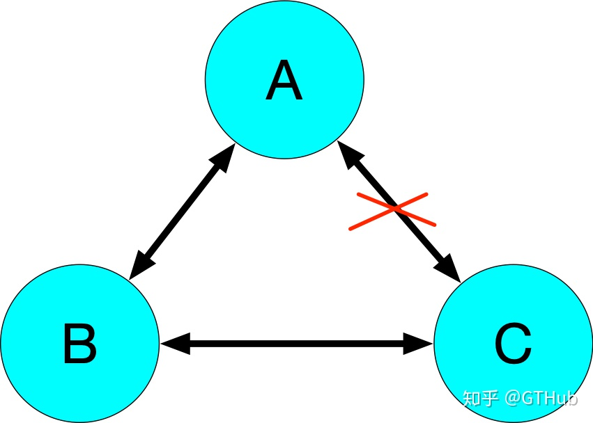

# dailies

## rpc超时设置

作为客户端，如何实现超时？

不管是如何进行socket的请求，都会把请求操作进行异步，然后通过future模式来获取值。

在future模式中会提供指定超时时间方法，在该方法中真正的请求在上述的异步执行中，而本线程会使用wait(超时时间)的方式进行阻塞。阻塞以后有两种方式被唤醒：

（1）wait的时间到了，自我唤醒。那么此时一般是超时的，会判断一下结果是产出来返回是否超时。

（2）被异步的执行唤醒（notify），这时一般会有有效的返回结果。此时会根据结果来判断是继续进行等待、返回结果等判断。

设置超时时间是为了解决什么问题？

从宏观上来说，是为了确保服务链路的稳定性，提供了一种框架级别的容错能力。

（1）不设置超时时间就会无限制的等待下去，造成整个应用的瘫痪。尤其是一些核心的业务，在调用一些非核心业务的时候，如果有超时时间就能在非核心业务响应过慢的时候，在等待时间达到后，进行降级，从而避免了核心业务被非核心业务拖死。

（2）服务的不可用可能是应为瞬间的网络抖动或者高负载引起的，如果超时后直接放弃则可能对业务造成损害。所以进行重试的话可以进行挽救。

引入超时机制后带来的副作用？

（1）重复请求：可能服务端已经执行完成了，客户端超时重试就会再次执行。所以服务端需要保障幂等性。

（2）可能降低调用者的负载能力：也就是说服务端真的发生故障的时候，调用者会不断的重试造成整体性能的下降。如果consumer是一个QPS很高的服务，那么必然造成连锁的雪崩反应。

（3）重试风暴：A->B->C->D 当D出现问题时，A,B,C都在重试，就形成了重试风暴。

## Mac 根目录无法访问处理

sudo vim /etc/synthetic.conf

写入 data	/Users/tal/data (中间是tab)

保存后重启电脑，根目录下就会出现data文件夹了。 data -> /Users/tal/data

## linux 命令收集

ss -lnt  # 查看socket状态

## 架构图

系统架构图是为了抽象的表示软件系统的整体轮廓、各个组件之间的相互联系、约束边界以及以及系统软件的物理部署和软件系统的演进方向的整体视图。

4+1视图

```
场景视图、逻辑视图、物理视图、处理流程视图和开发视图。

- 场景视图
场景视图用于表示系统的参与者与功能用例的关系，反映系统的最终需求和交互设计，通常由用例图进行表示。

- 逻辑视图
逻辑视图用于描写系统功能拆解后的组件关系、组件约束和边界，反映系统整体组成与系统如何构建的过程，通常由uml的组件图和类图来表示。

- 物理视图
物理视图用来描述系统软件到物理硬件的映射关系，反映出系统的组件是如何部署到一组可用的计算机节点上，用于指导软件系统的实施和部署过程。

- 处理流程视图
处理流程视图用于描述系统软件之间的的通信时序，数据的输入和输出，反映系统的功能流程和数据流程，通常由时序图和流程图来表示。

- 开发视图
开发视图用于描述系统的模块划分和组成，以及细化到内部包的组成设计，服务与开发人员，反映系统开发实施过程。


```


4c 画法

1、语境图(System Context Diagram)


这样一个简单的图，可以告诉我们，要构建的系统是什么，它的用户是谁，要如何融入当前已有的IT环境。

怎么画？中间是自己的系统，周围是用户和其他与之相互作用的系统。这个图的关键就是梳理清楚带建设的系统的用户和高层次的依赖。

2、容器图(Container Diagram)

容器图是把语境图里面待建设的系统做了一个展示。


这个图展现了软件系统的整体形态；体现了高层次的技术决策；系统中的职责是如何分布的，容器间是如何交互的；告诉开发者在哪里写代码。

怎么画？用一个框图来表示，内部可能包括名称、技术选择、职责，以及这些框图之间的交互，如果涉及外部系统，最好明确边界。

3、组件图(Component Diagram)


组件图是把某个容器进行展开，描述其内部的模块。

这张图描述了系统由哪些组件/服务组成，厘清了组件之间的关系和依赖，为软件开发如何交付提供了框架。

4、类图(code/class diagram)

## MESI

原文地址：https://www.jianshu.com/p/0e036fa7af2a

| 状态         | 描述                                                         |
| :----------- | ------------------------------------------------------------ |
| M(Modifed)   | 这行数据有效，数据被修改了，和内存中的数据不一致，数据只存在本Cache中。 |
| E(Exclusive) | 这行数据有效，这行数据和内存中的数据保持一致，数据只存在本Cache中。 |
| S(Shared)    | 这行数据有效，这行数据和内存中的数据保持一致，数据存在于很多Cache中。 |
| I(Invalid)   | 这行数据无效。                                               |

状态E


状态S


状态M I


## CPU草构

原文地址：https://zhuanlan.zhihu.com/p/48157076


cpu会将对cache的修改直接插入到storeBuffer中(如果缓存行的状态为M，E，那么就可以直接修改不会放到storeBuffer中。因为不需要通知其他cpu)；同时cpu在读取缓存的时候，会先存storeBuffer中读取，从而避免在storeBuffer中的修改读不到的问题。

当storeBuffer满了以后就会将buffer中的内容刷到cache中，从而触发cacheline的invalidate message，这些message会一起发送给其他的core，然后等到其他的core返回invalidate ack之后才能继续向下执行。为了进一步解耦，有引入了invalidate queue。

从SC中得到的保障：

**If L(a) <p L(b) ⇒ L(a) <m L(b) /\* Load→Load \*/**

**If L(a) <p S(b) ⇒ L(a) <m S(b) /\* Load→Store \*/**

**If S(a) <p S(b) ⇒ S(a) <m S(b) /\* Store→Store \*/**

**If S(a) <p L(b) ⇒ S(a) <m L(b) /\* Store→Load \*/**

每个共享内存的读取肯定是其在memory order中最近的一次写入的值。

### 内存屏障

smp_mb()是一种fullmemory barrier，会将store buffer 和 invalidate queue都flush一遍。

read memory barrier 会 flush invalidate queue。

write memory barrier 会 flush store buffer。


### program order VS memory order

program order：就是我们写的代码的顺序，这个是静态的也是每个CPU core各自拥有的。

memory order：就是代码执行的顺序，这个是全局的，每个CPU core对共享内存的执行都会出现在memory order中。

### SC (sequence consistency) definition

the result of any execution is the same as if the operations of all processors (cores) were executed in some sequential order, and the operations of each individual processor (core) appear in this sequence in the order specified by its program.

```
在任意的执行过程中，一些列的操在多核之间以某种线性顺序执行，同时同一个核中的所有的操作按照他自身程序所指定的顺序执行。
```

### TSO(Total Store Order)

在SC基础上的变化：

不保证storeload顺序 ：Core C1中S1和L1， S1先去L1执行，但是S1只是将值送入了write buffer就返回了，紧接着执行L1，L1在memory order中的点执行完之后，S1的write buffer这时候flush到内存，那么S1在memory order这条线上真正执行的点在L1之后了，那么这时候S1与L1就出现了reorder了。

load的最新值不一定是memory order中最近的，有可能是program order最近的store。

## 网络分区

网络分区分为对称网络分区与非对称网络分区，三个节点A，B，C，节点A是leader，A与B,C网络分区，这种是对称网络分区。如果A与B网络正常，与C网络分区，但是B与C之间网络正常，这种属于非对称网络分区。

对称网络分区


leader与follower出现非对称网络分区



follower与其他节点出现非对称分区


