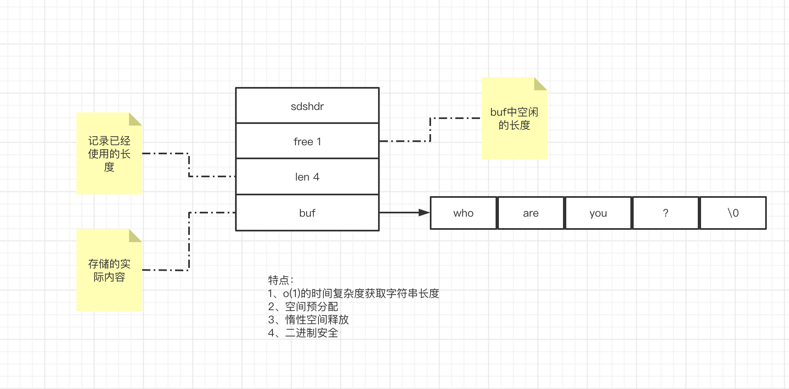

# dailies

## RPC超时设置

作为客户端，如何实现超时？

不管是如何进行socket的请求，都会把请求操作进行异步，然后通过future模式来获取值。

在future模式中会提供指定超时时间方法，在该方法中真正的请求在上述的异步执行中，而本线程会使用wait(超时时间)的方式进行阻塞。阻塞以后有两种方式被唤醒：

（1）wait的时间到了，自我唤醒。那么此时一般是超时的，会判断一下结果来返回是否超时。

（2）被异步的执行唤醒（notify），这时一般会有有效的返回结果。此时会根据结果来判断是继续进行等待、返回结果等判断。

设置超时时间是为了解决什么问题？

从宏观上来说，是为了确保服务链路的稳定性，提供了一种框架级别的容错能力。

（1）不设置超时时间就会无限制的等待下去，造成整个应用的瘫痪。尤其是一些核心的业务，在调用一些非核心业务的时候，如果有超时时间就能在非核心业务响应过慢的时候，在等待时间达到后，进行降级，从而避免了核心业务被非核心业务拖死。

（2）服务的不可用可能是应为瞬间的网络抖动或者高负载引起的，如果超时后直接放弃则可能对业务造成损害。所以进行重试的话可以进行挽救。

引入超时机制后带来的副作用？

（1）重复请求：可能服务端已经执行完成了，客户端超时重试就会再次执行。所以服务端需要保障幂等性。

（2）可能降低调用者的负载能力：也就是说服务端真的发生故障的时候，调用者会不断的重试造成整体性能的下降。如果consumer是一个QPS很高的服务，那么必然造成连锁的雪崩反应。

（3）重试风暴：A->B->C->D 当D出现问题时，A,B,C都在重试，就形成了重试风暴。

## Mac 根目录无法访问处理

sudo vim /etc/synthetic.conf

写入 data	/Users/tal/data (中间是tab)

保存后重启电脑，根目录下就会出现data文件夹了。 data -> /Users/tal/data

## brew切换镜像源

```
使用国内镜像源
# 步骤一
cd "$(brew --repo)"
git remote set-url origin https://mirrors.tuna.tsinghua.edu.cn/git/homebrew/brew.git

# 步骤二
cd "$(brew --repo)/Library/Taps/homebrew/homebrew-core"
git remote set-url origin https://mirrors.tuna.tsinghua.edu.cn/git/homebrew/homebrew-core.git

#步骤三
brew update

还原
cd "$(brew --repo)"
git remote set-url origin https://github.com/Homebrew/brew.git
 
cd "$(brew --repo)/Library/Taps/homebrew/homebrew-core"
git remote set-url origin https://github.com/Homebrew/homebrew-core
 
brew update
```

## 查看公网IP

curl ifconfig.me

## Maven打包时包含dll文件

<build>

<resources>
<resource>
<directory>src/main/java</directory>
<includes>
<include>**/*.dll</include>
</includes>
<filtering>false</filtering>
</resource>
</resources>

</build>

## linux 命令收集

ss -lnt  # 查看socket状态

dstat -d 可以查看磁盘的IO吞吐量

dstat -r  可以查看磁盘的随机读写吞吐量

dstat -n 可以查看网卡的IO吞吐量

## 架构图

系统架构图是为了抽象的表示软件系统的整体轮廓、各个组件之间的相互联系、约束边界以及以及系统软件的物理部署和软件系统的演进方向的整体视图。

4+1视图

```
场景视图、逻辑视图、物理视图、处理流程视图和开发视图。

- 场景视图
场景视图用于表示系统的参与者与功能用例的关系，反映系统的最终需求和交互设计，通常由用例图进行表示。

- 逻辑视图
逻辑视图用于描写系统功能拆解后的组件关系、组件约束和边界，反映系统整体组成与系统如何构建的过程，通常由uml的组件图和类图来表示。

- 物理视图
物理视图用来描述系统软件到物理硬件的映射关系，反映出系统的组件是如何部署到一组可用的计算机节点上，用于指导软件系统的实施和部署过程。

- 处理流程视图
处理流程视图用于描述系统软件之间的的通信时序，数据的输入和输出，反映系统的功能流程和数据流程，通常由时序图和流程图来表示。

- 开发视图
开发视图用于描述系统的模块划分和组成，以及细化到内部包的组成设计，服务与开发人员，反映系统开发实施过程。


```


4c 画法

1、语境图(System Context Diagram)


这样一个简单的图，可以告诉我们，要构建的系统是什么，它的用户是谁，要如何融入当前已有的IT环境。

怎么画？中间是自己的系统，周围是用户和其他与之相互作用的系统。这个图的关键就是梳理清楚带建设的系统的用户和高层次的依赖。

2、容器图(Container Diagram)

容器图是把语境图里面待建设的系统做了一个展示。


这个图展现了软件系统的整体形态；体现了高层次的技术决策；系统中的职责是如何分布的，容器间是如何交互的；告诉开发者在哪里写代码。

怎么画？用一个框图来表示，内部可能包括名称、技术选择、职责，以及这些框图之间的交互，如果涉及外部系统，最好明确边界。

3、组件图(Component Diagram)


组件图是把某个容器进行展开，描述其内部的模块。

这张图描述了系统由哪些组件/服务组成，厘清了组件之间的关系和依赖，为软件开发如何交付提供了框架。

4、类图(code/class diagram)

## MESI

原文地址：https://www.jianshu.com/p/0e036fa7af2a

| 状态         | 描述                                                         |
| :----------- | ------------------------------------------------------------ |
| M(Modifed)   | 这行数据有效，数据被修改了，和内存中的数据不一致，数据只存在本Cache中。 |
| E(Exclusive) | 这行数据有效，这行数据和内存中的数据保持一致，数据只存在本Cache中。 |
| S(Shared)    | 这行数据有效，这行数据和内存中的数据保持一致，数据存在于很多Cache中。 |
| I(Invalid)   | 这行数据无效。                                               |

状态E


状态S


状态M I


## CPU草构

原文地址：https://zhuanlan.zhihu.com/p/48157076


cpu会将对cache的修改直接插入到storeBuffer中(如果缓存行的状态为M，E，那么就可以直接修改不会放到storeBuffer中。因为不需要通知其他cpu)；同时cpu在读取缓存的时候，会先存storeBuffer中读取，从而避免在storeBuffer中的修改读不到的问题。

当storeBuffer满了以后就会将buffer中的内容刷到cache中，从而触发cacheline的invalidate message，这些message会一起发送给其他的core，然后等到其他的core返回invalidate ack之后才能继续向下执行。为了进一步解耦，有引入了invalidate queue。

从SC中得到的保障：

**If L(a) <p L(b) ⇒ L(a) <m L(b) /\* Load→Load \*/**

**If L(a) <p S(b) ⇒ L(a) <m S(b) /\* Load→Store \*/**

**If S(a) <p S(b) ⇒ S(a) <m S(b) /\* Store→Store \*/**

**If S(a) <p L(b) ⇒ S(a) <m L(b) /\* Store→Load \*/**

每个共享内存的读取肯定是其在memory order中最近的一次写入的值。

### 内存屏障

smp_mb()是一种fullmemory barrier，会将store buffer 和 invalidate queue都flush一遍。

read memory barrier 会 flush invalidate queue。

write memory barrier 会 flush store buffer。


### program order VS memory order

program order：就是我们写的代码的顺序，这个是静态的也是每个CPU core各自拥有的。

memory order：就是代码执行的顺序，这个是全局的，每个CPU core对共享内存的执行都会出现在memory order中。

### SC (sequence consistency) definition

the result of any execution is the same as if the operations of all processors (cores) were executed in some sequential order, and the operations of each individual processor (core) appear in this sequence in the order specified by its program.

```
在任意的执行过程中，一些列的操在多核之间以某种线性顺序执行，同时同一个核中的所有的操作按照他自身程序所指定的顺序执行。
```

### TSO(Total Store Order)

在SC基础上的变化：

不保证storeload顺序 ：Core C1中S1和L1， S1先去L1执行，但是S1只是将值送入了write buffer就返回了，紧接着执行L1，L1在memory order中的点执行完之后，S1的write buffer这时候flush到内存，那么S1在memory order这条线上真正执行的点在L1之后了，那么这时候S1与L1就出现了reorder了。

load的最新值不一定是memory order中最近的，有可能是program order最近的store。

## 网络分区

网络分区分为对称网络分区与非对称网络分区，三个节点A，B，C，节点A是leader，A与B,C网络分区，这种是对称网络分区。如果A与B网络正常，与C网络分区，但是B与C之间网络正常，这种属于非对称网络分区。

对称网络分区


leader与follower出现非对称网络分区


follower与其他节点出现对称分区


## 常见性能指标

QPS(Queries Per Second) : 每秒查询数。

TPS(Transactions Per Second): 每秒处理的事务数。

QPS 和 TPS的区别：

一个例子来说明：访问一个index页面会请求服务器3次，包括一次html，一次css，一次js，那么访问者一个页面就会产生一个“T”，产生三个“Q”。

并发数（并发度）：指系统同时能处理的请求数量，同样反映了系统的负载能力。这个数值可以分析机器1s内的访问日志数量来得到。

吞吐量：吞吐量是指系统在单位时间内处理请求的数量，TPS QPS都是吞吐量的量化指标。

PV(Page View) ：页面访问量，即页面浏览量或点击量，用户每次刷新就被计算一次。可以统一服务器一天的访问日志得到。

UV(Unique Visitor) : 独立访客，统计1天内访问某站点的用户数。

IOPS：这个指的是机器的随机IO并发处理的能力，比如机器可以达到200IOPS，意思就是说每秒可以执行200个随机IO读写请求。

## Java Type

1.ParameterizedType

ParameterizedType表示参数化类型，也就是泛型，例如List<T> Set<T>等。

有三个方法，

1.1 getActualTypeArguments

获取泛型中的实际类型，可能会存在多个泛型，例如Map<K,V>，所以会返回Type[]数组。值得注意的是，无论<>中有几层嵌套（List<Map<String,Integer>）,该方法返回的都是脱去最外层的<>以后的内容（Map<Stirng,Ingeger>）。

1.2 getRawType

获取声明泛型的类或者接口，也就是泛型中<>前面的值。Map<String,Integet>返回 java.util.Map。

1.3 getOwnerType

获取内部类的拥有者的类型，例如Map.Entry<String,String> 会返回 java.util.Map。

2.GenericArrayType

泛型数组类型，例如List<String>[] T[] 等。

2.1 getGenericCompontType 

返回泛型数组中的元素的Type类型，即List<String>[] 中的 List<String>(ParamerterizedTypeImpl)、T[]中的T（TypeVatiableImpl）。无论是几维数组，该方法都只会删除最右边的[]，返回剩余的内容。

3.TypeVariable

泛型的类型变量，指的是List<T> , Map<K,V>中的T,K,V等值。

3.1getBounds

获得该类型变量的上限，也就是泛型中extends右边的值；例如List<T extends Number> 返回的是Number；没有指明默认返回Object。值得注意的是，类型变量的上限可以为多个，必须使用&符号相连接，例如 List<T extends Number & Serializable>；其中，& 后必须为接口。

3.2getGenericDeclaration

获取声明该类型变量的实体，例如 Map<K,V>中的Map。而其中的GenericDeclaration（可以是Class Constructor Method）。

3.3getName

获取类型变量在源码中定义的名称。

4.Class 

5.WildcardType

？---通配符表达式，表示通配符泛型，但是WildcardType并不属于Java-Type中的一种；例如：List<? extends Number> 和 List<? super Integer>。

5.1getUpperBounds

例如 List<? extends Number> 返回 Number

5.2getLowerBounds

例如 List<? super String> 返回 String

## 泛型

```java
T[] t = null;
t = (T[]) new Object[22];

String[] str = null;
str = (String[]) new Object[22];
```

其中t运行是成功的，而str的运行是失败的。为什么？因为泛型会被擦除，将一个Object数组转为T数组，实际并没有进行转换，依然是Object类型的，只是告诉编译器可以安全的按照T来使用而已。

```java
public class Test {

    static <T> T[] toArray (T ... arr) {
        T[] arr1 = arr;
        return arr1;
    }

    static <T> T[] wrap(T a, T b) {
        return toArray(a, b);
    }


    public static void main(String[] args) {
        String[] wrap = wrap("a", "b");
    }
}
```

上面的方法是无法运行的，因为在调用toArray的时候是真的创建了一个Object数组，是无法转为String数组的。

## 泛型擦除

泛型实参只会在类、字段及方法参数内保存其签名，无法通过反射动态获取泛型实例的具体实参。

大白话就是，在编译为字节码后具体的.class文件中会保存该class的类、字段及方法参数上的泛型签名，定义的时候什么样获取的时候就是什么样。

在JVM中，方法体内中定义的***<u>对象</u>***的泛型、field上的泛型都会被擦除，变成类型转换。


如何获取泛型实参？

1、通过传递实参类型 ---- 也就是明确通过传递class的方式指定

2、明确定义泛型实参类型，通过反射获取签名 ---- 说白了，就是写代码的时候就在在类、字段、方法参数上定义了具体的泛型，利用了签名会被保存的原理。

3、通过匿名类捕获相关的泛型实参 ---- 创建了匿名类，jvm会为它生成class文件，也就能够保存签名信息了。

### 一个有趣的泛型擦除实验

```java
public abstract class  A<T> {
    public T a(T t) { return t;}
}

public abstract class B<T> extends A<T> {

    abstract public void b(T t);
}

public class C extends B<String> {

    @Override
    public void b(String s) {

    }
}


```

在C中方法b已经明确的将B中的方法b的泛型T变成了String。所以通过方法参数可以直接获取泛型的信息（1.8以前），也可以通过类签名获取泛型的信息或者方法参数的签名信息获取泛型的信息（1.8）。

同时在进行实验的过程中，发现在C中有两个b方法，具体如下

```
Classfile /Users/mipengcheng/IdeaProjects/JavaHamcrest/learn/build/classes/java/test/com/mpc/hamcrest/C.class
  Last modified 2021-8-29; size 568 bytes
  MD5 checksum 863b227ebd48874fbc4e581d32601a26
  Compiled from "C.java"
public class com.mpc.hamcrest.C extends com.mpc.hamcrest.B<java.lang.String>
  minor version: 0
  major version: 51
  flags: ACC_PUBLIC, ACC_SUPER
Constant pool:
   #1 = Methodref          #5.#22         // com/mpc/hamcrest/B."<init>":()V
   #2 = Class              #23            // java/lang/String
   #3 = Methodref          #4.#24         // com/mpc/hamcrest/C.b:(Ljava/lang/String;)V
   #4 = Class              #25            // com/mpc/hamcrest/C
   #5 = Class              #26            // com/mpc/hamcrest/B
   #6 = Utf8               <init>
   #7 = Utf8               ()V
   #8 = Utf8               Code
   #9 = Utf8               LineNumberTable
  #10 = Utf8               LocalVariableTable
  #11 = Utf8               this
  #12 = Utf8               Lcom/mpc/hamcrest/C;
  #13 = Utf8               b
  #14 = Utf8               (Ljava/lang/String;)V
  #15 = Utf8               s
  #16 = Utf8               Ljava/lang/String;
  #17 = Utf8               (Ljava/lang/Object;)V
  #18 = Utf8               Signature
  #19 = Utf8               Lcom/mpc/hamcrest/B<Ljava/lang/String;>;
  #20 = Utf8               SourceFile
  #21 = Utf8               C.java
  #22 = NameAndType        #6:#7          // "<init>":()V
  #23 = Utf8               java/lang/String
  #24 = NameAndType        #13:#14        // b:(Ljava/lang/String;)V
  #25 = Utf8               com/mpc/hamcrest/C
  #26 = Utf8               com/mpc/hamcrest/B
{
  public com.mpc.hamcrest.C();
    descriptor: ()V
    flags: ACC_PUBLIC
    Code:
      stack=1, locals=1, args_size=1
         0: aload_0
         1: invokespecial #1                  // Method com/mpc/hamcrest/B."<init>":()V
         4: return
      LineNumberTable:
        line 10: 0
      LocalVariableTable:
        Start  Length  Slot  Name   Signature
            0       5     0  this   Lcom/mpc/hamcrest/C;

  public void b(java.lang.String);
    descriptor: (Ljava/lang/String;)V
    flags: ACC_PUBLIC
    Code:
      stack=0, locals=2, args_size=2
         0: return
      LineNumberTable:
        line 15: 0
      LocalVariableTable:
        Start  Length  Slot  Name   Signature
            0       1     0  this   Lcom/mpc/hamcrest/C;
            0       1     1     s   Ljava/lang/String;

  public void b(java.lang.Object);
    descriptor: (Ljava/lang/Object;)V
    flags: ACC_PUBLIC, ACC_BRIDGE, ACC_SYNTHETIC
    Code:
      stack=2, locals=2, args_size=2
         0: aload_0
         1: aload_1
         2: checkcast     #2                  // class java/lang/String
         5: invokevirtual #3                  // Method b:(Ljava/lang/String;)V
         8: return
      LineNumberTable:
        line 10: 0
      LocalVariableTable:
        Start  Length  Slot  Name   Signature
            0       9     0  this   Lcom/mpc/hamcrest/C;
}
Signature: #19                          // Lcom/mpc/hamcrest/B<Ljava/lang/String;>;
SourceFile: "C.java"
```

有Object和String两种入参的b方法，而Object入参的会强制转换类型后调用String入参的方法。同时调用isSynthetic来判断发现Object入参的方法是jvm生成的。

为什么会有这样的一个以Object为入参的方法出现呢？答案就在类B中，类B中的b方法会被泛型擦书为以Object为入参。

这样来说真正的C要覆盖的方法是Object入参的b，所以jvm只能生成一个方法来覆盖，然后委托给真正的以String为入参的实现方法来实现功能。从而在多态的情况下，定义 B b = new C()的时候，调用b.b("x")能够成功的被调用。

## session的进化

1、单机的时候session很简单，把session_id保存在cookie或者url中，而用户的权限信息保存在服务端。每次请求通过sessionId来获取用户的信息。

2、在有了集群以后，可以使用粘性session，也就是通过负载均衡将同一个客户的请求映射到一台服务器，session信息还是保存在服务端，同样通过session_id来获取。这样的结果导致对一台服务器更新的时候就会丢失用户的登录信息。

3、为了克服以上的问题，可以有三种办法：

（1）session集中存储，例如保存在redis中。

（2）session复制：例如tomcat集群支持session复制。

（3）客户端session：也就是将session信息保存在客户端，通过服务端解密信息后获取用户的登录信息。

4、以前的认证都是各个服务器自己做自己的，在微服务的情况下，自己做自己的就有点冗余了。所以专门抽离了认证中心进行认证和保存用户信息。用户在认证中心认证，微服务通过认证中心获取用户信息。（类比1）

5、JWT 使得微服务本身可以不用访问认证中心就可以获取用户信息。（类比3-(3)）。

## spring

### 为什么要三级缓存

一个重要的结论：

当某个bean进入2级缓存的时候，说明这个bean的早期对象被其他bean注入了，也就是说，这个bean还是一个半成品，还未完成创建的时候，已经被别人拿去使用了，所以必须要有3级缓存，2级缓存中存放的是早期被别人使用的对象，如果没有2级缓存，是无法判断这个对象在创建过程中，是否被别人拿去使用了。

三级缓存是为了判断循环依赖的时候，早期暴露出去已经被别人使用的bean和最终的bean是否是同一个bean，如果不是同一个则弹出异常，如果早期的对象没有被其他bean使用，而后期被修改了，不会产生异常。如果没有三级缓存，就无法判断是否有循环依赖，且早期的bean被循环依赖中的bean使用了。

同时三级缓存缓存一个objectFactory，里边会调用getEarlyBeanReference，也就是通过这个修改早期返回的bean是哪个。这个实际使用的场景就是AOP。

### spring mvc请求流程


### @EnableSpringMvc

该注解会import DelegatingWebMvcConfiguration  --继承-->WebMvcConfigurationSupport(该类里边会默认注册很多bean到容器中)

而 DelegatingWebMvcConfiguration (会将用户自己实现的所有WebMvcConfigurer保存在自己的列表中，然后在调用相应方法的时候循环调用所有的WebMvcConfigurer。

### MVC常用注解

@ModelAttribe("message") 作用在controller或者controllerAdvice中方法上，为所有的作用范围内的controller方法里的model添加属性。

@RequestHeader("头属性") 作用在controller方法的参数上用来获取请求头信息。

@CookieValue("cookie名")作用在controller方法参数上获取cookie信息。

@ControllerAdvice controller上的统一切面，可以指定作用在哪些controller上。

@ExceptionHandler 作用在controller或者controllerAdvice中的方法上，用来处理作用范围内的异常。

## 故障排查

## 查看进程内存信息 pmap

pmap -x pid | sort -n -k3**

## 跟踪类加载情况、内存回收情况、本地方法调用情况

-verbose:class 查看类加载情况

-verbose:gc 查看虚拟机中内存回收情况

-verbose:jni 查看本地方法调用的情况

## jmap的功能

（1）jmap -heap pid  #查看某个pid的堆信息

（2）jmap -dump:alive,format=b,file=xxxxx.hprof pid

（3）jmap -clstatus pid 查看类信息

（4）jmap -histo pid 查看对象个数统计信息

## NativeMemoryTracking

-XX:NativeMemoryTracking=[off | summary | detail]

#off: 默认关闭

#summary:只统计各个分类的内存使用情况

#detail:Collect memory usage by individual call sites;

加了以上参数以后，可以使用下面的命令查看直接内存：

jcmd \<pid> VM.native_memory [summary | detail | baseline | summary.diff | detial.diff | shutdown] [scale = KB | MB | GB]

#summary: 分类内存使用情况

#detail：详细内存使用情况，除了summary信息之外还包含了虚拟内存使用情况。

#baseline：创建内存使用快照，方便和后面做对比

#summary.diff：和上一次baseline的summary对比

#detail.diff：和上一次baseline的detial对比

#shutdown：关闭NMT

```
jcmd pid VM.native_memory detial scale=MB > temp.txt
```

## 数据库

### 数据库连接池

```
连接数 = (核心数 * 2) + 有效磁盘数

核心数不应包含超线程(hyper thread)，即使打开了hyperthreading也是。如果活跃数据全部被缓存了，那么有效磁盘数是0，随着缓存命中率的下降，有效磁盘数逐渐趋近于实际的磁盘数。这一公式作用于SSD时的效果如何尚未有分析。
```

连接池的大小最终与系统特性相关。

比如一个混合了长事务和短事务的系统，通常是任何连接池都难以进行调优的。最好的办法是创建两个连接池，一个服务于长事务，一个服务于短事务。

再例如一个系统执行一个任务队列，只允许一定数量的任务同时执行，此时并发任务数应该去适应连接池连接数，而不是反过来。

### mysql数据库客户端请求流程


## hase

### hase删除数据

hbase不存储数据，它的所有数据都存储在Hdfs上。Hdfs文件系统不支持对文件的随机读写，那么Hbase对数据的删除操作是怎么实现的呢？

Hbase中删除记录并不是真正的删除了数据，而是放置了一个墓碑标记（tombstone marker），因为Hdfs不支持对文件的随机读写。被打上墓碑标记的记录在HFile合并时才会被真正的删除。

通过命令来验证

```
delete 'stu', '0001', 'info:address', 2

scan 'stu', {RAW=>true, VERSION=>3}
ROW                   COLUMN+CELL
0001									column=info:address, timestamp=3, value=address1
0001									column=info:address, timestamp=2, type=DeleteColumn
0001									column=info:address, timestamp=2, value=address1
0001									column=info:address, timestamp=1, value=address1
```

可以看到执行删除以后，会在指定的版本前插入一条墓碑数据，该墓碑数据之后的所有数据就都不可见了。

## 压测步骤

（1）需要定义一个系统的响应时间latency，建议是TP99，以及成功率。

比如：99.9%的响应时间必须在1ms之内，平均响应时间在1ms以内，100%的请求成功。

（2）在这个响应时间的限制下，找到最高的吞吐量。

测试用的数据，需要有大中小各种尺寸的数据，并可以混合。最好使用生产线上的测试数据。

（3）在这个吞吐量做soak test，比如：使用第二步测试得到的吞吐量连续7天的不间断的压测系统。

然后收集CPU，内存，硬盘，网络I/O等指标，查看系统是否稳定，比如，CPU是平稳的，内存使用也是平稳的。那么，这个值就是系统的性能。

（4）找到系统的极限值。比如：在成功率100%的情况下（不考虑相应时间的长短），系统能坚持10分钟的吞吐量。

（5）做Burst Test。用第二不得到的吞吐量执行5分钟，然后再第四步得到的吞吐量执行1分钟，再回到第二步的吞吐量执行5分钟，再回到第四步的权限执行1分钟，如此往复一段时间，比如2天。

收集系统的CPU、内存、硬盘、网络等指标，观察它们的曲线以及相应的响应时间，确保系统是稳定的。

（6）地吞吐量和网络小包的测试。有的时候，在地吞吐量的时候可能发生latency上升，比如tcp_nodelay的参数没有开启会导致latency上升，而网络小包会导致带宽用不满，也会导致性能上不去，所以，性能测试还需要根据实际情况有选择的测试一下这两个场景。

（注：我们用第二步得到的吞吐量乘以66.7%来作为系统的软报警线，80%作为系统的硬报警线，而极限值仅仅用来抗突发的peak。）

## Servlet3.1非阻塞例子


https://www.programcreek.com/java-api-examples/?code=chenmudu%2FTomcat8-Source-Read%2FTomcat8-Source-Read-master%2Fapache-tomcat-8.5.49-src%2Ftest%2Forg%2Fapache%2Fcatalina%2Fnonblocking%2FTestNonBlockingAPI.java

```java
private class TestReadWriteListener implements ReadListener {
        AsyncContext ctx;
        private final StringBuilder body = new StringBuilder();

        public TestReadWriteListener(AsyncContext ctx) {
            this.ctx = ctx;
        }

        @Override
        public void onDataAvailable() throws IOException {
            ServletInputStream in = ctx.getRequest().getInputStream();
            String s = "";
            byte[] b = new byte[8192];
            int read = 0;
            do {
                read = in.read(b);
                if (read == -1) {
                    break;
                }
                s += new String(b, 0, read);
            } while (in.isReady());
            log.info("Read [" + s + "]");
            body.append(s);
        }

        @Override
        public void onAllDataRead() throws IOException {
            log.info("onAllDataRead");
            ServletOutputStream output = ctx.getResponse().getOutputStream();
            output.setWriteListener(new WriteListener() {
                @Override
                public void onWritePossible() throws IOException {
                    ServletOutputStream output = ctx.getResponse().getOutputStream();
                    if (output.isReady()) {
                        log.info("Writing [" + body.toString() + "]");
                        output.write(body.toString().getBytes("utf-8"));
                    }
                    ctx.complete();
                }

                @Override
                public void onError(Throwable throwable) {
                    log.info("ReadWriteListener.onError");
                    throwable.printStackTrace();
                }
            });
        }

        @Override
        public void onError(Throwable throwable) {
            log.info("ReadListener.onError");
            throwable.printStackTrace();
        }

    }
```

## ThreadPoolExecutor

### 线程池中的锁

线程池中有两个锁 mainLock 和 worker，其中mainLock用来保障方法的线程安全，而worker锁的作用如下：

worker.new的时候就会有锁 <setState(-1)>

在runWorker的时候会w.unlock()来允许中断，然后会加锁w.lock()来执行任务。

shutdown的时候interruptWorker时会根据state>=0来判断现成是否启动了(初始-1， lock 1, unlock 0)

interuptIdleWorkers方法会w.tryLock()来保证只清除没有活干的线程。

## Redis

### Simple Dynamic String



## Tomcat

### Tomcat线程模型


1.initServerSocket(),通过ServerSocketChannel.open()打开一个ServerSocket，默认绑定到8080端口，默认的连接等待队列长度为100，当超过100时会拒绝服务。我们可以通过在conf/server.xml中的Connector的acceptCount属性对其进行设置。

2.createExecutor()用于创建Worker线程池。默认会启动10个Worker线程，Tomcat处理请求过程中，Worker最多不超过200个。我们可以通过配置conf/server.xml中的Connector的minSpareThreads 和 maxThreads 对这两个属性进行定制。

3.Poller用于检测已经就绪的Socket，默认不超过2个线程，我们可以通过配置 pollerThreadCount 设置。

4.Acceptor用于接收新的连接，默认1个线程，我们可以通过配置 acceptorThreadCount 对其进行设置。

### Tomcat总体结构


### Tomcat 文件目录接口

```
/bin 存放启动和关闭的脚本
/conf 存放Tomcat的各种全局配置文件，其中最重要的是server.xml
/lib 存放Tomcat以及所有web应用都可以访问的jar文件
/logs 存放Tomcat知识性产生的日志文件
/work 存放JSF编译后产生的class文件
/webapps Tomcat的web应用目录，默认情况下把web应用放在这个目录下
```


## Java基础

### java并发

#### AQS

（1）AQS在唤醒的时候为什么从尾部向前？

因为在入队的时候，插入tail是cas的，而next赋值并没有任何保护措施。所以前到后可能以为next字段为null而中断，而从后到前一定是成功的。

### MethodHandle

（1）例子

```java
public class Test {
  public static void main(String[] args) throws Throwable  {
    MethodHandles.Lookup lookup = MethodHandles.lookup();
    MethodType mt = MethodType.methodType(String.class,char.class,char.class);
    try {
      MethodHandle mh = lookup.findVirtual(String.class,"replace", mt);
      String handled_str = (String) mh.invoke("abc",'a','c');
      System.out.print(handled_str);
    } catch (NoSuchMethodException | IllegalAccessException e) {
      e.printStackTrace();
    }
  }
}
```


## Mybatis

1、获取mapper流程


2、Mapper接口和映射文件关联

其实是SqlSessionFactoryBuilder

\---------------

​			|

​			|


3、sql执行流程

（1）寻找sql


(2) 执行sql


4、自定义typeHandler

```java
package com.lonelyWolf.mybatis.typeHandler;

import org.apache.ibatis.type.BaseTypeHandler;
import org.apache.ibatis.type.JdbcType;

import java.sql.CallableStatement;
import java.sql.PreparedStatement;
import java.sql.ResultSet;
import java.sql.SQLException;

public class MyTypeHandler extends BaseTypeHandler<String> {

    @Override
    public void setNonNullParameter(PreparedStatement preparedStatement, int index, String param, JdbcType jdbcType) throws SQLException {
        System.out.println("自定义typeHandler生效了");
        preparedStatement.setString(index,param);
    }
 /**通过一下sql进行使用
 select user_id,user_name from lw_user where user_name=*#{userName,jdbcType=VARCHAR,typeHandler=com.lonelyWolf.mybatis.typeHandler.MyTypeHandler}
 */
```

```java
package com.lonelyWolf.mybatis.typeHandler;

import org.apache.ibatis.type.BaseTypeHandler;
import org.apache.ibatis.type.JdbcType;

import java.sql.CallableStatement;
import java.sql.PreparedStatement;
import java.sql.ResultSet;
import java.sql.SQLException;

public class MyTypeHandler extends BaseTypeHandler<String> {

    /**
     * 设置参数
     */
    @Override
    public void setNonNullParameter(PreparedStatement preparedStatement, int index, String param, JdbcType jdbcType) throws SQLException {
        System.out.println("设置参数->自定义typeHandler生效了");
        preparedStatement.setString(index,param);
    }
    /**
     * 根据列名获取结果
     */
    @Override
    public String getNullableResult(ResultSet resultSet, String columnName) throws SQLException {
        System.out.println("根据columnName获取结果->自定义typeHandler生效了");
        return resultSet.getString(columnName);
    }

    /**
     * 根据列的下标来获取结果
     */
    @Override
    public String getNullableResult(ResultSet resultSet, int columnIndex) throws SQLException {
        System.out.println("根据columnIndex获取结果->自定义typeHandler生效了");
        return resultSet.getString(columnIndex);
    }

    /**
     * 处理存储过程的结果集
     */
    @Override
    public String getNullableResult(CallableStatement callableStatement, int columnIndex) throws SQLException {
        return callableStatement.getString(columnIndex);
    }
}
/**
 <resultMap id="MyUserResultMap" type="lwUser">
        <result column="user_id" property="userId" jdbcType="VARCHAR" typeHandler="com.lonelyWolf.mybatis.typeHandler.MyTypeHandler" />
        <result column="user_name" property="userName" jdbcType="VARCHAR" />
    </resultMap>

<select id="listUserByUserName" parameterType="String" resultMap="MyUserResultMap">
        select user_id,user_name from lw_user where user_name=#{userName,jdbcType=VARCHAR,typeHandler=com.lonelyWolf.mybatis.typeHandler.MyTypeHandler}
    </select>
*/
```

## 常见的位运算

1、将x最右边的n位清零：x&(~0<<n)

2、获取x的第n+1位值(0或者1)：(x>>n)&1

3、获取x的第n位的幂值：x&(1<<(n-1))

4、仅将第n位置为1：x|(1<<(n-1))

5、仅将第n位置为0:  x&(~(1<<(n-1)))

6、将x最高位至第n位（含）清零：x&((1<<n)-1)

7、判断为偶数 (x&1)==0 判断为奇数 (x&1)==1

8、清零最低位的1 x = x&(x-1)

9、获取最低位的1 x = x&(-x)

## JVM

### 常识

1、如何评估一个系统每秒内会产占用多大的内存

（1）评估这一天内的有效时间（就是业务平凡发生的时间段）

（2）评估系统中创建较多的topK对象在有效时间内的创建数量

（3）分别计算topK对象每秒产生的对象个数，进而推算出每个JVM每秒产生的对象个数。

（4）根据每个对象的字段的大小估计每个对象所占用的内存

（5）估算某个对象每秒占用的内存，进而估算topK对象每秒占用内存

（6）对上面的结果扩大10到20倍（根据系统的大小），计算出整个系统每秒占用的内存大小。

FullGC优化的前提是MinorGC的优化，MinorGCC的优化前提是合理分配内存空间，合理分配内存空间的前提是对系统运行期的内存使用模型进行预估。

2、GC日志内容

主要包含三部分：Jvm系统参数、垃圾收集信息、堆内存使用情况。

### 常用参数

-XX:NewSize=5242880

-XX:MaxNewSize=5242880

-XX:IntialHeapSize=10485760

-XX:MaxHeapSize=10485760

-XX:SurvivoRatio=8

-XX:PretenureSizeThreshold=10486760

-XX:+UseParnewGC

-XX:+UseConcMarkSweapGC

-XX:+PrintGCDetails   打印详细的gc日志

-XX:+PrintGCTimeStamps 打印每次GC发生的时间

-Xloggc:gc.log	将gc日志写入一个磁盘文件

### 垃圾回收

#### 观察垃圾回收命令

-Xloggc:./gc-%t.log -XX:+PrintGCDetails -XX:+PrintGCDateStamps -XX:+PrintGCTimeStamps -XX:+PrintGCCause -XX:+UseGCLogFileRotaion -XX:NumberOfGCLogFiles=10 -XX:GCLogFileSize=100M

#### 垃圾收集所有参数查看

java -XX:+PrintFlagsIntial 表示打印出所有参数选项的默认值

java -XX:+PrintFlagsFinal 标识打印出所有参数选项在运行程序时生效的值

#### MinorGC流程

1、什么样的对象会进入到老年代？

（1）在历次minorGC中一直存活到【-XX:MaxTenuringThreshold】【默认是16 最大也是16 因为只有4位】的对象进入到老年代中。

（2）在minorGC后，如果年龄 1 2 ... n的对象占用的survivor区内存大小超过了50%，那么年龄在n+1 ... 的所有对象都进入到老年代中。

（3）对象大小超过【-XX:PretenureSizeThreshold】的对象直接进入到老年代中。

2、MinorGC流程


在上述的判断的两个Y的情况下，执行minorGC是又失败风险的【执行minorGC后的对象survivor区放不下】，这时如果老年代也放不下那么就会再执行一次fullGC。

#### 垃圾收集器汇总


#### jvm年轻代和老年代并不是完全隔离


jvm使用 从程序开始运行，就使用一个集合记录所有跨代引用的创建，在 young gc 时扫描这个集合里指向年轻代的跨代引用。 来解决young gc的扫描。

在 jvm 中再次使用分治法，将老年代划分成多个 card，只要 card 内对象引用被应用线程修改，就把 card 标记为 dirty。然后 young gc 时会扫描老年代中 dirty card 对应的内存区域，记录其中的跨代引用，这种方式被称为**Card Marking**。

jvm 通过写屏障（write barrier）来实现监控程序线程对引用的修改，并且标记对应 card，写屏障工作方式和**代理模式**类似，具体来说是通过在引用赋值指令执行时，添加对了 card table 的修改指令。

##### Parnew垃圾收集器

如何配置ParNewGC？使用-XX:+UseParNewGC。

一旦指定了ParNewGC来及回收器之后，默认会设置与CPU核数一样的线程数。线程数不需要进行优化，但是如果一定要进行修改，那么可以采用-XX:ParallelGCThreads 来进行设置。

```D
27.464: [GC (Allocation Failure) 27.464: [ParNew (promotion failed): 73971K->74006K(92160K), 0.0169041 secs]27.481: [CMS27.481: [CMS-concurrent-abortable-preclean: 0.036/1.030 secs] [Times: user=0.20 sys=0.01, real=1.03 secs] 
 (concurrent mode failure): 81926K->31223K(102400K), 0.0063179 secs] 135417K->31223K(194560K), [Metaspace: 3017K->3017K(1056768K)], 0.0233529 secs] [Times: user=0.16 sys=0.01, real=0.02 secs] 
28.493: [GC (Allocation Failure) 28.493: [ParNew: 73278K->0K(92160K), 0.0032536 secs] 104502K->51705K(194560K), 0.0033441 secs] [Times: user=0.03 sys=0.00, real=0.00 secs] 

在发生promotion failed 后一般就是 concurrent mode failure，此时会触发full gc 进行全局回收，而且新生代的数据会直接放到老年代中。
```


##### CMS垃圾收集器

```D
从gc日志进行分析
21.393: [CMS-concurrent-mark-start]
21.393: [CMS-concurrent-mark: 0.000/0.000 secs] [Times: user=0.00 sys=0.00, real=0.00 secs] 
21.393: [CMS-concurrent-preclean-start]
21.393: [CMS-concurrent-preclean: 0.000/0.000 secs] [Times: user=0.00 sys=0.00, real=0.00 secs] 
21.393: [CMS-concurrent-abortable-preclean-start]
23.522: [CMS-concurrent-abortable-preclean: 0.069/2.128 secs] [Times: user=0.16 sys=0.01, real=2.13 secs] 
23.522: [GC (CMS Final Remark) [YG occupancy: 43288 K (92160 K)]23.522: [Rescan (parallel) , 0.0006231 secs]23.523: [weak refs processing, 0.0000986 secs]23.523: [class unloading, 0.0003966 secs]23.523: [scrub symbol table, 0.0005826 secs]23.524: [scrub string table, 0.0001973 secs][1 CMS-remark: 61444K(102400K)] 104732K(194560K), 0.0020795 secs] [Times: user=0.00 sys=0.00, real=0.00 secs] 
23.524: [CMS-concurrent-sweep-start]
23.524: [CMS-concurrent-sweep: 0.000/0.000 secs] [Times: user=0.00 sys=0.00, real=0.00 secs] 
23.524: [CMS-concurrent-reset-start]
23.525: [CMS-concurrent-reset: 0.001/0.001 secs] [Times: user=0.00 sys=0.00, real=0.00 secs] 


initial-mark 初始标记（CMS的第一个STW阶段），标记GC Root直接引用的对象，GC Root直接引用的对象不多，所以很快。
concurrent-mark 并发标记阶段，由第一阶段标记过的对象出发，所有可达的对象都在本阶段标记。
concurrent-preclean 并发预清理阶段，也是一个并发执行的阶段。在本阶段，会查找前一阶段执行过程中,从新生代晋升或新分配或被更新的对象。通过并发地重新扫描这些对象，预清理阶段可以减少下一个stop-the-world 重新标记阶段的工作量。
concurrent-abortable-preclean 并发可中止的预清理阶段。这个阶段其实跟上一个阶段做的东西一样，也是为了减少下一个STW重新标记阶段的工作量。增加这一阶段是为了让我们可以控制这个阶段的结束时机，比如扫描多长时间（默认5秒）或者Eden区使用占比达到期望比例（默认50%）就结束本阶段。
remark 重标记阶段（CMS的第二个STW阶段），暂停所有用户线程，从GC Root开始重新扫描整堆，标记存活的对象。需要注意的是，虽然CMS只回收老年代的垃圾对象，但是这个阶段依然需要扫描新生代，因为很多GC Root都在新生代，而这些GC Root指向的对象又在老年代，这称为“跨代引用”。
concurrent-sweep ，并发清理
CMS-concurrent-reset，重置内部数据结构
```


在使用CMS垃圾收集器的时候，MaxTenuringThreshold的值为6，而使用parallel的时候是15.

其实是在不手动设置参数MaxTenuringThreshold/SurvivorRatio的情况下默认是6，但是你一旦手动的显式的设置了这两者中的任意一者，那么最大晋升年龄就会变成你手动设置的值/15.

在CMS垃圾收集器的时候新生代的默认值是Min(max_heap/(newRation + 1),scaleForWordSize(young_gen_per_worker * parallel_gc_threads))

CMS垃圾收集器分为一下几个步骤：

（1）初始标记

初始标记的时候系统是无法运行的，在这个阶段会识别当前系统中的所有的GCRoot。

（2）并发标记

在该阶段系统时可以运行的，在这个阶段会从上一个阶段中识别的GCRoot出发标记所有可达的存活的对象。

（3）补偿标记

在该阶段系统无法运行，在该阶段主要做的事情有两件。

首先会将上一步过程中新生成的GCRoot识别出来并遍历所有的GCRoot；其次会识别上一步中的GCRoot中已经失效的，取消标记。

（4）并发清理

该阶段系统可以正常运行，会清理所有没有被标记的对象。

CMS垃圾收集器默认使用的线程数量为 (CPU核数 + 3) / 4。

-XX:CMSInitiatingOccupancyFaction 可以用来设置老年代占用多少比例的时候触发CMS垃圾回收，JDK1.6里面默认是92%。这样做的意义主要在于在并发清理阶段还有可能有对象进入到老年代中，为这些对象预留了一部分空间，从而支持整个系统的正常运行。

然而预留的空间可能是不够用的，这时候就会触发 Concurrent Mode Failure，导致触发老年代的 “Serial Old”垃圾回收器，也就是stop the world，重新进行长时间的GC Roots追踪，标记出来全部垃圾对象，不允许新的对象产生，然后一次性把垃圾对象回收掉，完事以后再恢复系统线程。

CMS是使用的标记清理算法，这样一直运行下去会导致老年代中内存碎片化严重，而导致没有有效可用的空间来放置对象，从而表现为频繁的发生full gc。所以CMS有一个参数 -XX:+UseCMSCompactAtFullCollection（默认是打开的），该参数的作用就是在Full GC后进行stop the world，然后进行碎片整理，就是把存活对象挪到一起，空出来大片连续空间，避免内存碎片。

配合的参数是 -XX:CMSFullGCsBeforeCompaction 这个意思是执行多少次Full GC之后再执行一次内存碎片整理的工作，默认是0，意思是每次Full GC只有都会进行一次内存整理。

##### G1垃圾收集器

G1垃圾收集器最大的特点就是可以让我们设置一个垃圾回收的预期停顿时间。

也就是说我我们可以直接给G1指定在一个时间段内，垃圾回收导致的系统停顿时间不能超过多久。所以G1会选择最有效率的方式——选择最少的回收时间和最多回收对象的Region进行垃圾回收。

G1收集器有多少个region？默认会用堆大小除以2048，并且保证每个region的大小是2的倍数。一般不需要手动干预，也可以通过 -XX:G1HeapRegionSize来进行手动干预。

在初始的时候，新生代的默认占比为5%。可以通过 -XX:G1NewSizePercent 来设置，一般也维持默认值。然后在运行过程中，JVM会不停的给新生代增加更多的region，默认最高为60%。可以通过-XX:G1MaxNewSizePercent。同时随着垃圾回收，年轻代的比例就在两个值之间进行摆动。

在新生代所占用的region中会按照-XX:SurvivorRation=8来进行region的划分。也就是一个region不是eden就是survivor。

1、G1垃圾收集器的来及回收

当新生代的大小扩大到了新生代的最大值的时候，就会进行新生代的垃圾回收。也是使用复制算法进行来及回收并需要stop-the-world。但是G1是可以设定目标GC停顿时间的，也就是G1执行GC的时候最多可以让系统停顿多长时间，可以通过 -XX:MaxGCPauseMills 来设定，默认值是200ms。也就是说G1会对每个Region追踪回收他需要多长时间，可以回收多少对象，来选择回收一部分的Region，保证GC停顿时间控制带指定范围内，尽可能多的回收掉一些对象。

2、G1新生代中的对象何时回进入到老年代？

（1）对象在新生代躲过了很多次的垃圾回收，达到了一定的年龄了，就会进入到老年代。

（2）动态年龄判定规则。

3、G1如何处理大对象？

在G1中，一个大对象的定义是超过了Region大小的50%，比如一个Region的大小是2MB，只要一个对象超过了1MB，就会被放入大对象专门的Region中，而且一个大对象如果太大，可能会横跨多个Region来存放。在新生代或者老年代进行垃圾回收的时候，都会对大对象的Region进行回收。

4、什么时候进行新生代和老年代的混合垃圾回收？

G1有一个参数 -XX:InitiatingHeapOccupancyPercent 默认值是45% 。 当老年代的大小占比达到该值的时候就会进行新生代和老年代的混合垃圾回收。

5、G1混合回收的过程

（1）初始标记

这个过程需要进入“Stop the World”，仅仅只是标记一下GC Roots直接能引用的对象，这个过程速度很快。

（2）并发标记

这个阶段会允许系统程序的运行，同时进行GC Roots追踪。会从GC Roots开始追踪所有的存活对象。同时会记录一些修改信息，比如哪个对象被新建了，哪个对象失去了引用。

（3）最终标记

这个阶段会进入 “Stop the World”，会根据并发标记阶段记录的那些对象修改，最终标记一下有哪些存活对象，有哪些垃圾对象。

（4）混合回收

该阶段会计算老年代中每个Region中的存活对象数量，存活对象占比，还有执行垃圾回收的预期性能和效率。接着会“Stop the World”，然后进行垃圾回收，此时会选择部分Region进行回收，因为必须让垃圾回收的停顿时间控制在我们指定的范围内。

在混合回收的阶段会根据 -XX:G1MixedGCCountTarget 来进行多次的“Stop the World” 操作，也就是把规定时间内预计要回收的垃圾分配到这几次中。每次回收少量的Region，然后恢复系统，如此循环。 该参数的默认值是8。

另一个参数 -XX:G1HeapWastePercent(默认值5%)，作用是在混合回收的过程中一旦空闲出来的Region数量达到了堆内存的5%，此时就会立即停止混合回收。

另一个参数 -XX:G1MixedGCLiveThresholdPercdent（默认值85%），也就是在混合回收的过程中如果一个Region内的存活对象数量的占比高于该值是不会被回收的。

6、回收失败时的Full GC

如果在进行Mixed GC的时候，无论是年轻代还是老年代都基于复制算法进行回收，都要把各个Region的存活对象拷贝到别的Region里去，此时万一出现拷贝的过程中发现没有空闲的Region可以承载自己的存活对象了，就会触发一次失败。一旦失败，立马就会切换为停止系统程序，然后采用单线程进行标记、清理和压缩整理，空闲出来一批Region，这个过程是极慢的。

7、新生代什么时候进行回收？

G1会根据预设的gc停顿时间，给新生代分配一些Region，然后到一定程度就会触发gc，并且把gc时间控制在预设范围内，尽量避免一次性回收过多的Region导致gc停顿时间超出预期。

##### 垃圾收集常用命令

jstack

用来查看线程信息，最经常使用的场景就是用来查看线程死锁问题。

jstack找出占用cpu最高的线程堆栈信息

jstat

```sh
Metaspace由Klass Metaspace和NoKlass Metaspace两部分组成
jstat -gc pid
S0C    S1C    S0U    S1U      EC       EU        OC         OU       MC     MU    
s0大小  s1大小 s0用量  s1用量 eden区大小 eden区用量 老年代大小 老年代用量 meta区大小 meta区用量
CCSC   CCSU       YGC           YGCT         FGC          FGCT         GCT
类区空间 类区用量    younggc次数   younggc时间   fullgc次数    fullgc时间		gc总耗时

jstat -gccapacity pid
 NGCMN(新生代初始容量)    NGCMX(新生代最大容量)     NGC(当前新生代容量)     S0C(s0容量)   S1C(s1容量)       EC(eden容量)      OGCMN(老年代初始容量)      OGCMX(老年代最大容量)       OGC(老年代当前容量)         OC(老年空间当前容量)       MCMN(元数据初始容量)     MCMX(元数据区最大容量)      MC(元数据区当前容量)     CCSMN(类空间初始容量)    CCSMX(类控件最大容量)     CCSC(类空间当前容量)    YGC(年轻代gc次数)    FGC(full gc次数)
 
jstat -gcnew pid
S0C(s0容量)    S1C(s1容量)    S0U(s0用量)    S1U(s1用量)   TT(实际对象进去老年代的年龄) MTT(设置的进入老年代的最大年龄)  DSS(期望的幸存区大小)      EC(eden区的小)       EU(eden区用量)     YGC(young gc 次数)     YGCT(young gc 时间)

jstat -gcnewcapacity pid
NGCMN(新生代初始容量)      NGCMX(新生代最大容量)       NGC(新生代当前容量)      S0CMX(s0最大容量)     S0C(s0当前容量)     S1CMX(s1最大容量)     S1C(s1最大容量)       ECMX(eden区最大容量)        EC(eden区当前容量)      YGC(young gc 次数)   FGC(full gc 次数)

jstat -gcold pid
MC(元数据容量)       MU(元数据用量)      CCSC(类空间容量)     CCSU(类空间用量)       OC(老年代空间容量)          OU(老年代空间用量)       YGC(young gc 次数)    FGC(full gc 次数)    FGCT(full 时间)     GCT(gc时间)

jstat -gcoldcapacity pid
OGCMN(老年代初始大小)       OGCMX(老年代最大大小)       OGC(老年代当前大小)         OC(老年代空间大小)       YGC(young gc 次数)   FGC(full gc 次数)    FGCT(full gc 时间)     GCT(gc 时间)

jstat -gcmetacapacity pid
MCMN(元空间初始大小)      MCMX(元空间最大)        MC(元空间当前)       CCSMN(类空间初始大小)      CCSMX(类空间最大大小)       CCSC(类空间当前大小)     YGC(young gc 次数)   FGC(full gc 次数)    FGCT(full gc 时间)     GCT(gc 时间)

jstat -class pid
Loaded(加载类数量)  Bytes(加载类大小)  Unloaded(卸载类数量)  Bytes(卸载类大小)     Time(加载和卸载用的总时间)

jstat -compiler pid
Compiled(执行了多少次编译) Failed(失败数) Invalid(无效的)   Time(花费时间)   FailedType(最后一次编译失败的类型) FailedMethod(最后一次编译失败的方法)

jstat -gccause pid
S0     S1     E      O      M     CCS    YGC     YGCT    FGC    FGCT     GCT    LGCC  GCC

jstat -gcutil pid
S0     S1     E      O      M     CCS    YGC     YGCT    FGC    FGCT     GCT

jstat -gc pid 1000 10 #每秒打印一次gc日志，一共打印10次


# 主动进行垃圾回收
jcmd pid GC.run
```

jmap

```shell
jmap -heap pid
会打印出来堆内存相关的一些参数设置，然后就是当前的堆内存里的一些基本各个区域的情况。
jmap -histo pid
会按照各种对象占用内存空间的大小降序排列，把占用内存最多的对象放在最上面。
jmap -dump:live,format=b,file=dump.hprof pid
可以导出堆内存快照。然后可以使用jhat进行分析(jhat dump.hprof -port 7000)，也可以使用其他工具进行分析。
```

##### 垃圾收集实战

```java
/**
 * @author ：mipengcheng3
 * @date ：Created in 2021/11/18 上午10:20
 * @description：一个所谓的bi系统的gc模拟
 * 配合运行的jvm参数
 * -XX:NewSize=104857600 -XX:MaxNewSize=104857600 -XX:InitialHeapSize=209715200 -XX:MaxHeapSize=209715200 -XX:SurvivorRatio=8 -XX:PretenureSizeThreshold=3145728 -XX:+UseParNewGC -XX:+UseConcMarkSweepGC -XX:MaxTenuringThreshold=15 -XX:+PrintGCDetails -XX:+PrintGCTimeStamps -Xloggc:gc.log
 */
public class BiSystemGcTest {
    /**
     * main方法，用来模拟gc
     * @param args 没有任何的args
     * @throws InterruptedException 当线程被打断的时候会抛出
     */
    public static void main(String[] args) throws InterruptedException {
        //给一个机会运行 jstat -gc pid 1000 1000(没1秒打印一下gc情况，运行1000次)
        Thread.sleep(20000);
        while (true) {
            loadData();
        }
    }

    /**
     * 模拟每秒的并发量为50并且加载的数据量大小为100KB
     * @throws InterruptedException 当线程在sleep的时候被打断时会抛出
     */
    private static void loadData() throws InterruptedException {
       byte[] data = null;
       for (int i = 0; i < 50; i++) {
           data = new byte[100 * 1024];
       }
       data = null;
       Thread.sleep(1000);
    }
}
```

```java
package com.jd.http.base.gc;

/**
 * @author ：mipengcheng3
 * @date ：Created in 2021/11/19 上午10:12
 * @description：模拟的计算系统的Full gc场景
 * 有问题的gc参数
 * -XX:NewSize=104857600 -XX:MaxNewSize=104857600 -XX:InitialHeapSize=209715200 -XX:MaxHeapSize=209715200 -XX:SurvivorRatio=8 -XX:PretenureSizeThreshold=20971520 -XX:+UseParNewGC -XX:+UseConcMarkSweepGC -XX:MaxTenuringThreshold=15 -XX:+PrintGCDetails -XX:+PrintGCTimeStamps -Xloggc:gc.log
 * 优化后的gc参数
 * -XX:NewSize=209715200 -XX:MaxNewSize=209715200 -XX:InitialHeapSize=314572800 -XX:MaxHeapSize=314572800 -XX:SurvivorRatio=2 -XX:PretenureSizeThreshold=20971520 -XX:+UseParNewGC -XX:+UseConcMarkSweepGC -XX:MaxTenuringThreshold=15 -XX:+PrintGCDetails -XX:+PrintGCTimeStamps -Xloggc:gc.log
 */


/**
 * 4C8G场景下的GC模板
 * -Xms4096M -Xmx4096M -Xmn3072M -Xss1M -XX:PermSize=256M -XX:MaxPermSize=256M -XX:+UseParNewGC -XX:+UseConcMarkSweepGC
 * -XX:CMSInitiatingOccupancyFaction=92 -XX:+UseCMSCompactAtFullCollection -XX:CMSFullGCsBeforeCompaction=0
 * -XX:+CMSParallelInitialMarkEnabled -XX:+CMSScavengeBeforeRemark
 * */
public class CalFullGcTest {
    public static void main(String[] args) throws InterruptedException {
        Thread.sleep(20000);
        while (true) {
            loadData();
        }
    }

    /**
     * a fake load data
     * @throws InterruptedException if the thread is interrupted
     */
    private static void loadData() throws InterruptedException {
        byte[] data = null;
        for (int i = 0; i < 4; i++) {
            data = new byte[10 * 1024 * 1024];
        }
        data = null;

        byte[] data1 = new byte[10 * 1024 * 1024];
        byte[] data2 = new byte[10 * 1024 * 1024];

        byte[] data3 = new byte[10 * 1024 * 1024];
        data3 = new byte[10 * 1024 * 1024];

        Thread.sleep(1000);
    }
}

```


```D
两个JVM参数 -XX:TraceClassLoading -XX:TraceCalssUnloading 可以在日志中看到类的加载和卸载日志

java通过反射创建的类都是 软引用，而软引用在回收的时候有一个判定公式 clock-timestamp <= freespace * SoftRefLRUPolicyMSPerMB 
  （软引用未被访问的时间长度 <= jvm空间的MB数 * 每MB能提供的时间）
 
```


### 安全点、安全区域

#### OopMap

前文我们说到，JVM 采用的可达性分析法有个缺点，就是从 `GC Roots` 找引用链耗时。

都说他耗时，他究竟耗时在哪里？  
GC 进行扫描时，需要查看每个位置存储的是不是引用类型，如果是，其所引用的对象就不能被回收；如果不是，那就是基本类型，这些肯定是不会引用对象的；这种对 GC 无用的基本类型的数据非常多，每次 GC 都要去扫描，显然是非常浪费时间的。  
而且迄今为止，所有收集器在 `GC Roots` 枚举这一步骤都是必须暂停用户线程的。

那有没有办法减少耗时呢？  
一个很自然的想法，能不能用空间换时间? 把栈上的引用类型的位置全部记录下来，这样到 GC 的时候就可以直接读取，而不用一个个扫描了。Hotspot 就是这么实现的，这个用于存储引用类型的数据结构叫 `OopMap`。  
`OopMap` 这个词可以拆成两部分：`Oop` 和 `Map`，`Oop` 的全称是 `Ordinary Object Pointer` 普通对象指针，`Map` 大家都知道是映射表，组合起来就是 普通对象指针映射表。

在 `OopMap` 的协助下，HotSpot 就能快速准确地完成 `GC Roots` 枚举啦。

#### 安全点

`OopMap` 的更新，从直观上来说，需要在对象**引用关系发生变化**的时候修改。不过导致引用关系变化的指令非常多，如果对每条指令都记录 `OopMap` 的话 ，那将会需要大量的额外存储空间，空间成本就会变得无法忍受的高昂。选用一些特定的点来记录就能有效的缩小需要记录的数据量，这些特定的点就称为 **安全点 (Safepoint)**。

有了安全点，当 GC 回收需要停止用户线程的时候，将设置某个中断标志位，各个线程不断轮询这个标志位，发现需要挂起时，自己跑到最近的安全点，更新完 `OopMap` 才能挂起。这主动式中断的方式是绝大部分现代虚拟机选择的方案，另一种抢占式就不介绍了。

安全点不是任意的选择，既不能太少以至于让收集器等待时间过长，也不能过多以至于过分增大运行时的内存负荷。通常选择一些执行时间较长的指令作为安全点，如**方法调用**、**循环跳转**和**异常跳转**等。

#### 安全区域

使用安全点的设计似乎已经完美解决如何停顿用户线程，让虚拟机进入垃圾回收状态的问题了。但是，如果此时线程正处于 `Sleep` 或者 `Blocked` 状态，该怎么办？这些线程他不会自己走到安全点，就停不下来了。这个时候，安全点解决不了问题，需要引入 **安全区域 (Safe Region)**。

安全区域指的是，在某段代码中，**引用关系不会发生变化**，线程执行到这个区域是可以安全停下进行 GC 的。因此，我们也可以把 安全区域 看做是扩展的安全点。

当用户线程执行到安全区域里面的代码时，首先会标识自己已经进入了安全区域。那样当这段时间里虚拟机要发起 GC 时，就不必去管这些在安全区域内的线程了。当线程要离开安全区域时，它要检查虚拟机是否处于 STW 状态，如果是，则需要等待直到恢复。

#### 总结

HotSpot 使用 `OopMap` 把引用类型的指针记录下来，让 `GC Roots` 的枚举变得快速准确。  
为了减少更新 `OopMap` 的开销，引入了 **安全点**。GC STW 时，线程需要跑到距离自己最近的**安全点**，更新完 `OopMap` 才能挂起。  
处于`Sleep` 或者 `Blocked` 状态的线程无法跑到**安全点**，需要引入**安全区域**。GC 的时候，不会去管处于安全区域的线程，线程离开安全区域的时候，如果处于 STW 则需要等待直至恢复。

### 三色标记法误标的两个条件（同时满足）

1. 赋值器插入了一条或者多条黑色对象到白色对象的引用
2. 赋值器删除了全部从灰色对象到白色对象的直接引用或者间接引用

#### 误标解决方案

### 增量更新

增量更新要破坏的是第一个条件，当黑色对象插入新的指向白色对象的引用关系时，就将这个新插入的引用记录下来，等并发扫描结束之后，再将这些记录过的引用关系中的黑色对象为根，重新扫描一次。这可以简化理解为，黑色对象一旦新插入了指向白色对象的引用之后，它就变回灰色对象了。

### 原始快照 (STAB)

原始快照要破坏的是第二个条件，当灰色对象要删除指向白色对象的引用关系时，就将这个要删除的引用记录下来，在并发扫描结束之后，再将这些记录过的引用关系中的灰色对象为根，重新扫描一次。这也可以简化理解为，无论引用关系删除与否，都会按照刚刚开始扫描那一刻的对象图快照来进行搜索。

链接：https://juejin.cn/post/6996123086296252453

## 一些新兴的软件工具

### mybatis-mate

主要功能：字典绑定、字段加密、数据脱敏、表结构动态维护、数据审计记录、数据范围（数据权限）、数据库分库分表 动态数据源 读写分离 数据库健康检查自动切换。

```xml
<dependency>
	<groupId>com.baomidou</groupId>
	<artifactId>mybatis-mate-starter</artifactId>
	<version>1.0.8</version>
</dependency>
<dependency>
	<gourpId>com.baomidou</gourpId>
  <artifactId>mybatis-mate-annotation</artifactId>
  <version>1.0.8</version>
</dependency>
```

## bean searcher

主要功能：用于进行列表检索。快速实现数据的查询。把很多功能都通过入参来进行控制了，不用写代码，但是需要写参数了。

```xml
<dependency>
	<groupId>com.ejlchina</groupId>
  <artifactId>bean-searcher-boot-starter</artifactId>
  <version>3.0.1</version>
</dependency>
```

## **[retrofit-spring-boot-starter](https://gitee.com/lianjiatech/retrofit-spring-boot-starter)**

主要功能：一个好用的http请求封装工具。

```xml
<dependency>
	<groupId>com.github.lianjiatech</groupId>
	<artifactId>retrofit-spring-boot-starter</artifactId>
	<version>2.2.16</version>
</dependency>
```

## Camel动态路由

方式1 ：<toD />标签
<toD uri="${in.header.nextUri}">
通过toD标签即可实现路由的动态跳转。
也结合条件判断使用动态跳转。

<choice>
    <!-- 串行或分支执行 -->
    <when>
        <simple>${property.type} == 'serial' or ${property.type} == 'branch'</simple>
        <toD uri="${property.nextUrl}" />
    </when>
</choice>

方式2 ：<routingSlip/>标签

```xml
<route> 
   <from uri="direct:a"/> 
   <routingSlip ignoreInvalidEndpoints="true"/> 
​    <header>nextUri</header> 
​  </routingSlip> 
</route>
```


## JSF动态加载试探

```java
package com.jd.jdrc;

import com.jd.jsf.gd.config.ProviderConfig;
import com.jd.jsf.gd.config.RegistryConfig;
import com.jd.jsf.gd.config.ServerConfig;
import com.jd.jsf.gd.registry.ClientRegistry;
import com.jd.jsf.gd.registry.RegistryFactory;
import com.jd.jsf.gd.util.Constants;
import com.jd.jsf.gd.util.JSFContext;
import javassist.ClassPool;
import javassist.CtClass;

import java.lang.reflect.InvocationHandler;
import java.lang.reflect.Method;
import java.lang.reflect.Proxy;

/**
 * @author Libo <libo51@jd.com>
 * @version v0.1
 * @Description <描述>
 *
 * <p>
 * @date 2021/11/11
 */
public class ApplicationForWebTest {

    //全局只需要一个注册中心client
    private static ClientRegistry CLIENT_REGISTRY;
    static {
        //参见https://cf.jd.com/pages/viewpage.action?pageId=245185287#JSF%E5%AE%A2%E6%88%B7%E7%AB%AF%E7%94%A8%E6%88%B7%E6%89%8B%E5%86%8C-APPID%E5%8F%8AAPPNAME%E4%BC%A0%E9%80%92
        //一定要设置这两个字段，会进行校验；
        //不要随意填写，防止和别的应用名字冲突，这个两个字段可以通过jdos申请应用获取，即使不部署也可以申请一个空应用，用于获取appId及appName；
        JSFContext.putIfAbsent( JSFContext.KEY_APPID, "123456" );
        JSFContext.putIfAbsent( JSFContext.KEY_APPNAME, "test_app" );
        //设置jsf客户端与注册中心的心跳间隔，默认30秒；
        JSFContext.putGlobalVal(Constants.SETTING_REGISTRY_HEARTBEAT_INTERVAL, "30000");
        //设置jsf客户端从注册中心定期拉取provider列表的时间间隔，一般设置120秒，不要太快，对注册中心有压力；
        JSFContext.putGlobalVal(Constants.SETTING_REGISTRY_CHECK_INTERVAL, "120000");
        //注册中心配置信息，通过index寻址注册中心地址；
        RegistryConfig registryConfig = new RegistryConfig();
        registryConfig.setIndex("i.jsf.jd.com");
        //仅订阅注册中心服务发现
        CLIENT_REGISTRY = RegistryFactory.getRegistry(registryConfig);
    }


    public static void main(String[] args) throws Exception {

        ClassPool pool = ClassPool.getDefault();
        CtClass cc = pool.makeInterface("com.jd.jnos.baize.rest.TestSub");
        cc.setInterfaces(new CtClass[] {pool.getCtClass("com.jd.jnos.baize.rest.Test")});
        Class<?> aClass = cc.toClass();
        Object o = Proxy.newProxyInstance(ApplicationForWebTest.class.getClassLoader(), new Class[]{aClass}, new InvocationHandler() {
            @Override
            public Object invoke(Object proxy, Method method, Object[] args) throws Throwable {
                return "a";
            }
        });

        //设置要发布服务的ip及端口
        ServerConfig serverConfig = new ServerConfig();
        serverConfig.setHost(JSFContext.getLocalHost()); //获取本机ip；
        serverConfig.setPort(8090);//设置提供服务的端口;
        

        ProviderConfig providerConfig = new ProviderConfig();
        providerConfig.setInterfaceId("com.jd.jnos.baize.rest.TestSub");
        providerConfig.setAlias("aa");
        providerConfig.setServer(serverConfig);
        providerConfig.setRef(o);
        //重要的：发起注册请求
        CLIENT_REGISTRY.register(providerConfig,null);

        synchronized (ApplicationForWebTest.class){
            ApplicationForWebTest.class.wait();
        }


    }
}
```

```java
@Component
@Slf4j
public class TestCommandLineRunner implements CommandLineRunner, BeanClassLoaderAware {

    ClassLoader classLoader;

    @Override
    public void run(String... args) throws Exception {
        loadJsf();
    }

    @Override
    public void setBeanClassLoader(ClassLoader classLoader) {
     this.classLoader = classLoader;
    }

    private void loadJsf() throws Exception {
        ClassPool pool = ClassPool.getDefault();
        CtClass cc = pool.makeInterface("com.jd.jnos.baize.service.TestSub");

        CtMethod ctMethod = new CtMethod(pool.getCtClass("java.lang.String"), "test",
                new CtClass[] {pool.getCtClass("java.lang.String")}, cc);
        ctMethod.setModifiers(Modifier.PUBLIC);
        ctMethod.setModifiers(Modifier.ABSTRACT);
        cc.addMethod(ctMethod);


        Class<?> aClass = cc.toClass(classLoader, null);
        Object o = Proxy.newProxyInstance(classLoader, new Class[]{aClass}, new InvocationHandler() {
            @Override
            public Object invoke(Object proxy, Method method, Object[] args) throws Throwable {
                return "a";
            }
        });

        //设置要发布服务的ip及端口
        ServerConfig serverConfig = new ServerConfig();
        serverConfig.setHost(JSFContext.getLocalHost()); //获取本机ip；
        serverConfig.setPort(22000);//设置提供服务的端口;
        serverConfig.setTelnet(true);


        //注册中心配置信息，通过index寻址注册中心地址；
        RegistryConfig registryConfig = new RegistryConfig();
        registryConfig.setIndex("i.jsf.jd.com");
        //仅订阅注册中心服务发现


        ProviderConfig providerConfig = new ProviderConfig();
        providerConfig.setInterfaceId("com.jd.jnos.baize.service.TestSub");
        providerConfig.setAlias("aa");
        providerConfig.setServer(serverConfig);
        providerConfig.setRegistry(registryConfig);
        providerConfig.setRef(o);

        providerConfig.export();
    }

}
```


## 使用字节码生成类

```java
public static BaizeJsfProviderConfig<?> generateJsfInterface(String alias, String clazz, List<String> methods,
                                                     ClassLoader classLoader, JsfConsumer jsfConsumer,
                                                     int port, String index)
        throws NotFoundException, CannotCompileException {
    log.info("alias: {}, class: {}, methods: {}, port: {}, index: {}", alias, clazz, methods, port, index);
    //去重
    Set<String> methodSet = new HashSet<>(methods);

    //创建类，并生成动态代理
    Class<?> aClass = null;


    ClassPool pool = new ClassPool(null);
    pool.appendSystemPath();
    //构建interface

    CtClass cc = pool.makeInterface(clazz);
    //构建所有的方法
    for (String method : methodSet) {
        CtMethod ctMethod = new CtMethod(pool.getCtClass(MAP_ARG), method,
                new CtClass[]{pool.getCtClass(MAP_ARG)}, cc);
        ctMethod.setModifiers(Modifier.PUBLIC);
        ctMethod.setModifiers(Modifier.ABSTRACT);
        cc.addMethod(ctMethod);
    }

    ConsumerContainerClassLoader consumerContainerClassLoader = new ConsumerContainerClassLoader(classLoader);

    aClass = cc.toClass(consumerContainerClassLoader, null);

    //创建动态代理
    JsfComponentInvocationHandler jsfComponentInvocationHandler = new JsfComponentInvocationHandler(jsfConsumer);
    Object res = Proxy.newProxyInstance(consumerContainerClassLoader, new Class[]{aClass}, jsfComponentInvocationHandler);
    BaizeJsfProviderConfig providerConfig = providerConfig(consumerContainerClassLoader, index, port, clazz, alias, res);
    return providerConfig;
}
```

## 各种开源协议汇总


### 安装GraalVM

参考：https://www.graalvm.org/22.0/docs/getting-started/macos/

1. 下载对应压缩包：https://github.com/graalvm/graalvm-ce-builds/releases
2. 在MAC环境下要执行 sudo xattr -r -d com.apple.quarantine /Users/mipengcheng3/works/graalvm/active
3. 执行./gu install native-image

## java课程笔记

### 内存分配

指针碰撞
空闲链表
    解决分配过程中的并发问题
        CAS 谁抢到谁成功
        TLAB 每个线程预先分配一个区间，各自在自己的区间上进行内存分配

### 对象内存空间占用构成

在HotSpot虚拟机中，对象在内存中的存储可以分为3个区域：对象头、实例数据和对齐填充。对象头有三行：类型指针（Klass Pointer）、MarkWord以及数据特有的数组长度

### 逃逸分析 

-XX:+DoEscapeAnalysis

#### 标量替换

如果栈帧中没有足够的空间存放一个不会逃逸的对象，那么会将该对象的成员变量分解为若干个被这个方法使用的成员变量代替，这些代替的成员变量在栈帧或寄存器上分配空间，这样就不会因为没有一大块连续空间导致对象内存不够分配。开启标量替换参数：-XX:+EliminateAllocations （JDK7之后默认开启）。

### 字符串常量

```java
    @Test
    public void testString() {
        String a = new String("b") + new String("b");
        String b = a.intern();
        String c = "bb";

        System.out.println(a==b);
        System.out.println(a==c);
        System.out.println(b==c);

    }
    
    @Test
    public void testString() {
        String a = new String("b") + new String("b");
        String c = "bb";
        String b = a.intern();
        

        System.out.println(a==b);
        System.out.println(a==c);
        System.out.println(b==c);

    }
    
    @Test
    public void testStringJava() {
        String a = new String("ja") + new String("va");
        String b = a.intern();

        System.out.println(a == b);
    }
```

### Tomcat

Tomcat就是一个HTTP服务器+Servlet容器，我们亲切地称呼它为WEB容器。

CATALINA_HOME 里面只需要包含bin 和 lib

CATALINA_BASE 包含 logs webapp conf

## 解决MAC通过virtualbox安装ubuntu时 Could not mount the media/drive
```
sudo mkdir --p /media/cdrom
sudo mount -t auto /dev/cdrom /media/cdrom/
cd /media/cdrom/
sudo sh VBoxLinuxAdditions.run
```

# brew相关命令

```bash
brew install openjdk@15 #安装openjdk 15
#为了能够让idea打开，需要创建如下软连接
sudo ln -sfn /usr/local/opt/openjdk/libexec/openjd.jdk /Libary/Java/JavaVirtualMachines/openjdk.jdk

brew install maven #安装maven

brew install node #安装node js 已经npm
```

