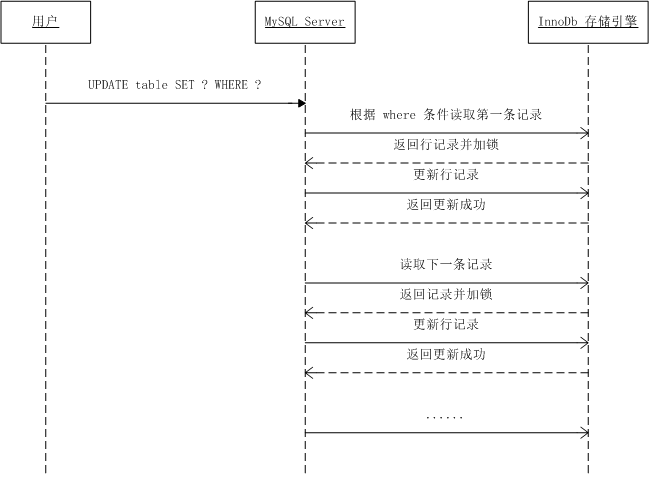

# Mysql

## Mysql安装


一、配置Mysql扩展源


```ruby
rpm -ivh http://repo.mysql.com/yum/mysql-5.7-community/el/7/x86_64/mysql57-community-release-el7-10.noarch.rpm
```

二、yum安装mysql


```undefined
yum install mysql-community-server -y
```

三、启动Mysql，并加入开机自启


```bash
systemctl start mysqld
systemctl enable mysqld
```

四、使用Mysq初始密码登录数据库


```dart
mysql -uroot -p$(awk '/temporary password/{print $NF}' /var/log/mysqld.log)
```

五、修改数据库密码
 数据库默认密码规则必须携带大小写字母、特殊符号，字符长度大于8否则会报错。
 因此设定较为简单的密码时需要首先修改set global validate_password_policy和_length参数值。


```csharp
mysql> set global validate_password_policy=0;
Query OK, 0 rows affected (0.00 sec)
mysql> set global validate_password_length=1;
Query OK, 0 rows affected (0.00 sec)
```

六、修改密码


```css
mysql> set password for root@localhost = password('123456');
Query OK, 0 rows affected, 1 warning (0.00 sec)
```

七、登录测试


```ruby
[root@http-server ~]# mysql -uroot -p123456
mysql> show databases;
+--------------------+
| Database           |
+--------------------+
| information_schema |
| mysql              |
| performance_schema |
| sys                |
+--------------------+
4 rows in set (0.00 sec)
mysql> exit
```

八、其他机器可访问

```
登陆mysql,执行下列sql语句

    use mysql；

    update user set host='%' where user = 'root';

    flush privileges;
```

## 数据库事务

### 不可重复读和幻读的区别

不可重复读指的是当前事务受到了其他事务中的update的影响，而幻读指的是当前事务受到了其他事务中的insert和delete操作的影响。

### 丢失更新

(1) 由于提交事务而导致的丢失更新问题


(2) 由于事务回滚导致的丢失更新问题


### MVCC

{min_idx, [创建MVCC时活跃的事务id], current_idx, max_idx}

min_idx : 创建MVCC时活跃的事务id中最小的

[...] : 创建MVCC时所有的活跃的事务id

current_idx : 当前的事务id

max_idx: 创建MVCC时数据库会生成的下一个事务的id

如何使用MVCC？

MVCC是和undo log列表配合使用的，在读取一条数据的时候如果发现这个数据的事务id小于 min_idx，那么这条数据是可以查看的。如果大于等于max_idx，那么这条数据是无法查看的。如果这条数据的事务id在[min_idx, max_idx)的区间内，那么如果在[...]中，那么说明该事务还在活跃，所以数据无法访问。如果不在[...]中，那么说明该事务已经提交，这条数据就是可见的。

#### mysql如何使用MVCC

在RM级别的时候，事务中的每次select操作都会生成一个MVCC。

在RR级别的时候，事务中只有第一次select操作才会生成一个MVCC。 

### 数据库的锁

从类型上区分有读锁和写锁；

从力度上区分有表锁和行锁；

从持有时间上区分有临时锁和持久锁。

#### 表锁 VS. 行锁

表锁指的是对一整张表加锁，一般是DDL处理时使用，也可以在自己的SQL中指定；而行锁指的是锁定某一行或者某几行，或行和行之间的间隙。

表锁由MySQL服务器实现，行锁由存储引擎实现，常见的就是InnoDb，所以通常我们在讨论行锁时，隐含的一层意义就是数据库的引擎为InnoDb，而MyISAM存储引擎只使用表锁。

##### 1.1表锁

表锁由 MySQL 服务器实现，所以无论你的存储引擎是什么，都可以使用。一般在执行 DDL 语句时，譬如 **ALTER TABLE** 就会对整个表进行加锁。在执行 SQL 语句时，也可以明确对某个表加锁，譬如下面的例子：

```
# 加了一个读锁并进行查询操作
lock table products read;
select * from products where id = 100;
unlock tables;

# 加写锁
lock table products write;
```

表锁使用的**一次封锁**技术，也就是说，我们会在回话开始的地方使用lock命令将后面所有要用到的表加上锁，在锁释放之前，我们只能访问这些加锁的表，不能访问其他的表，最后通过unlock tables释放所有的锁。这样做的好处是不会发生死锁。

```
mysql> lock table products read, orders read;
Query OK, 0 rows affected (0.00 sec)
 
mysql> select * from products where id = 100;
 
mysql> select * from orders where id = 200;
 
mysql> select * from users where id = 300;
ERROR 1100 (HY000): Table 'users' was not locked with LOCK TABLES
 
mysql> update orders set price = 5000 where id = 200;
ERROR 1099 (HY000): Table 'orders' was locked with a READ lock and can't be updated
 
mysql> unlock tables;
Query OK, 0 rows affected (0.00 sec)

#可以看到由于没有对 users 表加锁，在持有表锁的情况下是不能读取的，另外，由于加的是读锁，所以后面也不能对 orders # 表进行更新。
```

MySQL表锁的加锁规则如下：

（1）对于读锁

​		持有读锁的会话可以读表，但不能写表；

​		允许多个会话同时持有读锁；

​		其他会话计算没有给表加读锁，也是可以读表的，但是不能写表；

​		其他会话申请该表写锁时会阻塞，知道锁释放。

（2）对于写锁

​		持有写锁的会话既可以读表也可以写表；

​		只有持有写锁的会话才可以访问该表，其他会话访问该表会被阻塞，知道锁释放；

​		其他会话无论申请该表的读锁或写锁，都会阻塞，直到锁释放。

表锁的释放规则：

​		使用unlock tables 语句可以显示释放所有表锁；

​		如果会话在持有表锁的情况下执行lock tables语句，将会释放该会话之前持有的锁；

​		如果会话在持有表锁的情况下执行start transaction 或 begin 开启一个事务，将会释放该会话之前持有的锁；

​		如果会话连接断开，将会释放该会话所有的锁。

##### 1.2行锁

行锁和表锁对比如下：

表锁：开销小，加锁快；不会出现死锁；锁粒度大，发生锁冲突的概率最高，并发度最低；

行锁：开销大，加锁慢；会出现死锁；锁粒度最小，发生锁冲突的概率最低，并发度也最高。

行锁和表锁一样也分为两种类型：读锁和写锁。常见的增删改查（INSERT、DELETE、UPDATE）语句会自动对操作的数据行加写锁，查询的时候也可以明确指明锁的类型：SELECT ... LOCK IN SHARE MODEL 语句加的是读锁，SELECT ... FOR UPDATE语句加的是写锁。

在MySQL中行锁是加在索引上的。

MySQL加锁流程：

当执行下面语句时，InnoDb存储引擎会在id=49这个主键索引上加一把X锁。

```
mysql> update students set score = 100 where id = 49;
```

当执行下面语句时（name 为 students 表的二级索引），InnoDb 存储引擎会在 name = 'Tom' 这个索引上加一把 X 锁，同时会通过 name = 'Tom' 这个二级索引定位到 id = 49 这个主键索引，并在 id = 49 这个主键索引上加一把 X 锁。

```
mysql> update students set score = 100 where name = 'Tom';
```


复杂的范围内的语句加锁

```
mysql> update students set level = 3 where score >= 60;
```



###### 行锁种类

```
mysql> UPDATE accounts SET level = 100 WHERE id = 5;
```

LOCK_ORDINARY:也称为Next-Key Lock，锁一条记录及其之前的间隙，这是RR隔离级别用的最多的锁。

假设一个索引包含10、11、13 和 20 这几个值，可能的 Next-key 锁如下：

- (-∞, 10]
- (10, 11]
- (11, 13]
- (13, 20]
- (20, +∞)

通常我们都用这种左开右闭区间来表示 Next-key 锁，其中，圆括号表示不包含该记录，方括号表示包含该记录。前面四个都是 Next-key 锁，最后一个为间隙锁。和间隙锁一样，在 RC 隔离级别下没有 Next-key 锁，只有 RR 隔离级别才有。继续拿上面的 SQL 例子来说，如果 id 不是主键，而是二级索引，且不是唯一索引，那么这个 SQL 在 RR 隔离级别下会加什么锁呢？答案就是 Next-key 锁，如下：

- (a, 5]
- (5, b)

其中，a 和 b 是 id = 5 前后两个索引，我们假设 a = 1、b = 10，那么此时如果插入一条 id = 3 的记录将会阻塞住。之所以要把 id = 5 前后的间隙都锁住，仍然是为了解决幻读问题，因为 id 是非唯一索引，所以 id = 5 可能会有多条记录，为了防止再插入一条 id = 5 的记录，必须将下面标记 ^ 的位置都锁住，因为这些位置都可能再插入一条 id = 5 的记录：

1 ^ 5 ^ 5 ^ 5 ^ 10 11 13 15

可以看出来，Next-key 锁确实可以避免幻读，但是带来的副作用是连插入 id = 3 这样的记录也被阻塞了，这根本就不会引起幻读问题的。


LOCK_GAP:间隙锁，锁两个记录之间的GAP，防止记录插入。

还是看上面的那个例子，如果 id = 5 这条记录不存在，这个 SQL 语句还会加锁吗？答案是可能有，这取决于数据库的隔离级别。

还记得我们在上一篇博客中介绍的数据库并发过程中可能存在的问题吗？其中有一个问题叫做 **幻读**，指的是在同一个事务中同一条 SQL 语句连续两次读取出来的结果集不一样。在 read committed 隔离级别很明显存在幻读问题，在 repeatable read 级别下，标准的 SQL 规范中也是存在幻读问题的，但是在 MySQL 的实现中，使用了间隙锁的技术避免了幻读。

间隙锁是一种加在两个索引之间的锁，或者加在第一个索引之前，或最后一个索引之后的间隙。有时候又称为范围锁（Range Locks），这个范围可以跨一个索引记录，多个索引记录，甚至是空的。使用间隙锁可以防止其他事务在这个范围内插入或修改记录，保证两次读取这个范围内的记录不会变，从而不会出现幻读现象。很显然，间隙锁会增加数据库的开销，虽然解决了幻读问题，但是数据库的并发性一样受到了影响，所以在选择数据库的隔离级别时，要注意权衡性能和并发性，根据实际情况考虑是否需要使用间隙锁，大多数情况下使用 read committed 隔离级别就足够了，对很多应用程序来说，幻读也不是什么大问题。

回到这个例子，这个 SQL 语句在 RC 隔离级别不会加任何锁，在 RR 隔离级别会在 id = 5 前后两个索引之间加上间隙锁。

值得注意的是，间隙锁和间隙锁之间是互不冲突的，间隙锁唯一的作用就是为了防止其他事务的插入，所以加间隙 S 锁和加间隙 X 锁没有任何区别。

LOCK_REC_NOT_GAP:只锁记录。

注意，如果 SQL 语句无法使用索引时会走主索引实现全表扫描，这个时候 MySQL 会给整张表的所有数据行加记录锁。如果一个 WHERE 条件无法通过索引快速过滤，存储引擎层面就会将所有记录加锁后返回，再由 MySQL Server 层进行过滤。不过在实际使用过程中，MySQL 做了一些改进，在 MySQL Server 层进行过滤的时候，如果发现不满足，会调用 unlock_row 方法，把不满足条件的记录释放锁（显然这违背了二段锁协议）。这样做，保证了最后只会持有满足条件记录上的锁，但是每条记录的加锁操作还是不能省略的。可见在没有索引时，不仅会消耗大量的锁资源，增加数据库的开销，而且极大的降低了数据库的并发性能，所以说，更新操作一定要记得走索引。

LOCK_INSERT_INTENSION:插入意向GAP锁，插入记录的时候使用，是LOCK_GAP的一种特例。

插入意向锁是一种特殊的间隙锁（所以有的地方把它简写成 II GAP），这个锁表示插入的意向，只有在 INSERT 的时候才会有这个锁。注意，这个锁虽然也叫意向锁，但是和上面介绍的表级意向锁是两个完全不同的概念，不要搞混淆了。**插入意向锁和插入意向锁之间互不冲突**，所以可以在同一个间隙中有多个事务同时插入不同索引的记录。譬如在上面的例子中，id = 1 和 id = 5 之间如果有两个事务要同时分别插入 id = 2 和 id = 3 是没问题的，虽然两个事务都会在 id = 1 和 id = 5 之间加上插入意向锁，但是不会冲突。

**插入意向锁只会和间隙锁或 Next-key 锁冲突**，正如上面所说，间隙锁唯一的作用就是防止其他事务插入记录造成幻读，那么间隙锁是如何防止幻读的呢？正是由于在执行 INSERT 语句时需要加插入意向锁，而插入意向锁和间隙锁冲突，从而阻止了插入操作的执行。


注：列是已有的锁，行是要插入的锁。

针对插入意向锁的总结：

- 插入意向锁不影响其他事务加其他任何锁。也就是说，一个事务已经获取了插入意向锁，对其他事务是没有任何影响的；
- 插入意向锁与间隙锁和 Next-key 锁冲突。也就是说，一个事务想要获取插入意向锁，如果有其他事务已经加了间隙锁或 Next-key 锁，则会阻塞。


剩余的总结：

- 间隙锁不和其他锁（不包括插入意向锁）冲突；
- 记录锁和记录锁冲突，Next-key 锁和 Next-key 锁冲突，记录锁和 Next-key 锁冲突；

#### 读锁 VS. 写锁

MySQL 将锁分成两类：锁类型（lock_type）和锁模式（lock_mode）。锁类型就是上文中介绍的表锁和行锁两种类型，当然行锁还可以细分成记录锁和间隙锁等更细的类型，锁类型描述的锁的粒度，也可以说是把锁具体加在什么地方；而锁模式描述的是到底加的是什么锁，譬如读锁或写锁。锁模式通常是和锁类型结合使用的，锁模式在 MySQL 的源码中定义如下：

LOCK_IS:读意向锁；

LOCK_IX:写意向锁；

LOCK_S:读锁；

LOCK_X:写锁；

LOCK_AUTO_INC:自增锁。

将锁分为读锁和写锁主要是为了提高读的并发，如果不区分读写锁，那么数据库将没办法并发读，并发性将大大降低。而 IS（读意向）、IX（写意向）只会应用在表锁上，方便表锁和行锁之间的冲突检测。LOCK_AUTO_INC 是一种特殊的表锁。

各种锁之间的冲突关系


总结：

（1）意向锁之间互不冲突；

（2）S锁只和S/IS锁兼容，其他锁都冲突；

（3）X锁和其他所有锁都冲突；

（4）AI锁只和意向锁兼容。


AUTO_INC锁的类型：

可以通过参数innodb_autoinc_lock_mode参数来配置AUTO_INC锁的类型。

innodb_autoinc_lock_mode = 0 (transaction lock mode)

锁到语句结束。

innodb_autoinc_lock_mode = 1 (consecutive lock mode)

自动批量生成。

innodb_autoinc_lock_mode = 2 (interleaved lock mod)

轻量级，完全无锁。会造成同一个语句中生成的id不连续。

#### X_LATCH S_LATCH

每个 mini-transaction 会遵守下面的几个规则：

- 修改一个页需要获得该页的 X-LATCH；
- 访问一个页需要获得该页的 S-LATCH 或 X-LATCH；
- 持有该页的 LATCH 直到修改或者访问该页的操作完成。

所以，最后的最后，真相只有一个：`insert` 和 `select ... lock in share mode` 不会发生幻读。整个流程如下：

1. 执行 `insert` 语句，对要操作的页加 RW-X-LATCH，然后判断是否有和插入意向锁冲突的锁，如果有，加插入意向锁，进入锁等待；如果没有，直接写数据，不加任何锁，结束后释放 RW-X-LATCH；
2. 执行 `select ... lock in share mode` 语句，对要操作的页加 RW-S-LATCH，如果页面上存在 RW-X-LATCH 会被阻塞，没有的话则判断记录上是否存在活跃的事务，如果存在，则为 `insert` 事务创建一个排他记录锁，并将自己加入到锁等待队列，最后也会释放 RW-S-LATCH；

