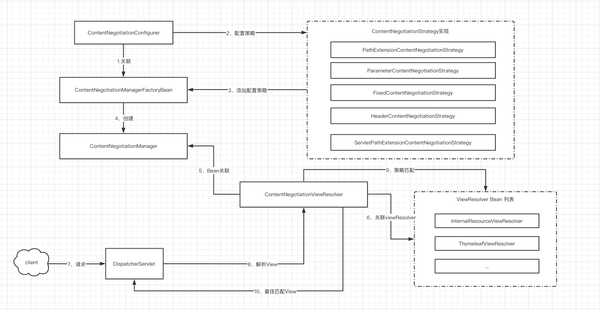
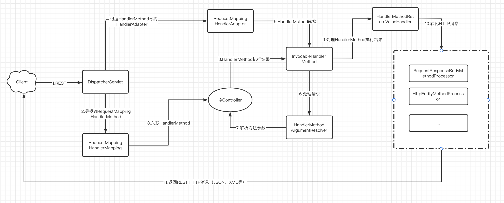
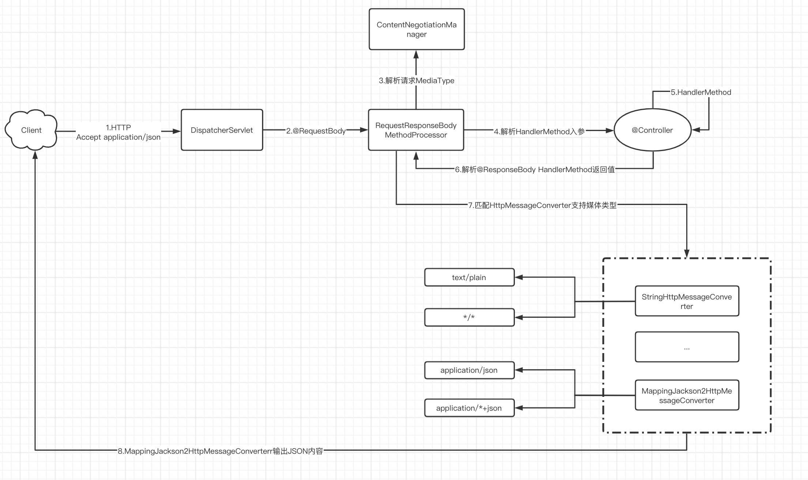
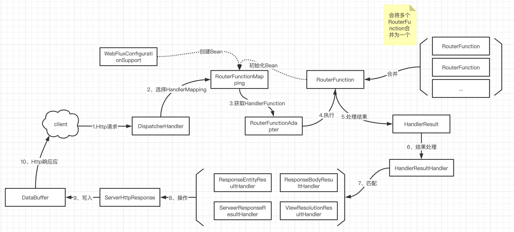
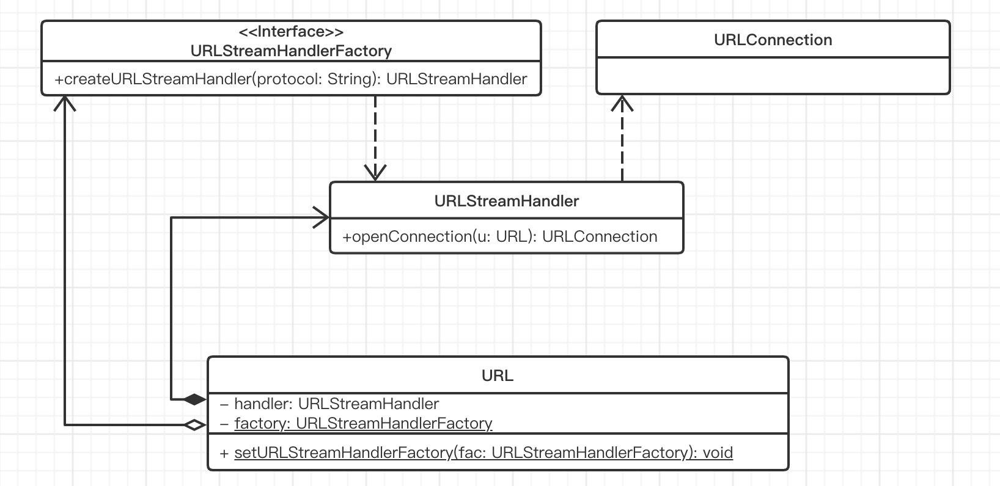

# spring

## springboot

### servlet原生

#### servlet注册

-1、通过web.xml来进行注册

0、通过ServletContext.add来进行注册，在ServletContextInitializer中会用到。

1、@WebServlet + @ServletComponentScan

~~2、@Bean 等方式注册为spring的原生~~

3、使用对应的RegistrationBean 例如 ServletRegistrationBean

#### 异步非阻塞的servlet

异步：javax.servlet.ServletRequest#startAsync()

​			javax.servlet.AsyncContext()

非阻塞：javax.servlet.ServletInputStream#setReadListener

​						javax.servlet.ReadListener

​				javax.servlet.ServletOutputStream#setWriteListener

​						javax.servlet.WriteListener

```java
@WebServlet(urlPatterns="/test", asyncSupported=true)
public class MyServlet extends HttpServlet {
  protected void doGet(HttpServletRequest req, HttpServletResponse resp) {
    AsyncContext asyncContext = req.startAsync();
    asyncContext.start(() -> {
      ////
      asyncContext.complete();//这是必须要的
    });
  }
}
```


### 配置文件

#### 使用配置

1、XML中使用$占位符 结合 PropertyPlaceholderConfigurer (spring时代) springboot时代就不需要PropertyPlaceholderConfigurer了，直接使用$占位符 + @ImportResource注解即可。

2、@Value可以作用在field上，也可以使用在方法的参数上。

3、通过Environment来获取,可以结合Binder来进行使用。

4、@ConfigurationProperties 可以支持静态内部类中的属性嵌套赋值，可以支持spring自带的validation，配合 @Validated来实现。

#### 自定义的时机

在Spring Framework中应该在AbstractApplicationContext#prepareBeanfactory方法前。

在SpringBoot中，应该在SpringApplication#refreshContext方法前。

在Environment中会封装很多PropertySource

#### 自定义外部化配置

1、基于SpringApplicationRunListener#environmentPrepared

2、基于ApplicationEnvironmentPreparedEvent扩展(有ApplicationRunListener的默认实现EventPublishingRunListener在environmentPrepared发出，通过自己在spring.factories中定义自己的事件监听器来获取相应的事件)

3、基于EnvironmentPostProcessor扩展

4、基于ApplicationContextIntializer扩展

5、基于SpringApplicationRunListener#contextPropered扩展

6、基于ApplicationPreparedEvent扩展(实现方式同2)

#### 配置文件查找位置

1、classpath 根路径

2、classpath 根路径下config目录

3、jar包当前目录

4、jar包当前目录的config目录

5、/config目录和第一层子目录

#### 配置文件加载顺序

1、当前jar包内部的application.properties 和 application.yml

2、当前jar包内部的application-{profile}.properties 和 application-{profile}.yml

3、引用外部jar包的application.properties 和 application.yml

4、引用的外部jar包的application-{profile}.properties 和 application-{profile}.yml

```undefined
yml > yaml > properties 后边的会覆盖前面的
```

后面的可以覆盖前面的同名配置项。

### springboot启动流程

#### SpringApplication的运行方式

（1）直接使用SpringApplication.run(..)

（2）new SpringApplication() 然后设置各种参数，最后执行run

（3)  new SpringApplicationBuilder() 可以使用fluent API来设置各种参数，最后执行run

#### 准备阶段

（1）配置 springboot bean来源

（2）Web应用类型推断

servelet的方式优先于reactive的方式。

（3）推断主类

（4）加载应用上下文初始化器（ApplicationContextInitializer）

应用上下文初始化器保存在META-INF/spring.factories中，通过SpringFacotoriesLoader来进行加载。

（5）加载应用事件监听器（ApplicationListener）

应用事件监听器保存在META-INF/spirng.factories中，通过SpringFacotoriesLoader来进行加载。

#### 运行阶段

（1）加载“SpringApplication运行”监听器（SpringApplicationRunListener）

应用事件监听器保存在META-INF/spirng.factories中，通过SpringFacotoriesLoader来进行加载。

构造方法中必须有 SpringApplication 和 String[] 类型的两个参数，springboot会默认传进来，不传进来会报错。

默认的一个实现为 EventPublishingRunListener

就是这个Listener内部会持有一个SimpleApplicationEventMulticaster，然后将上一步中（5）中的SrpingListener都加进来给他们发送事件。

（2）运行"SrpingApplication运行"监听器

（3）监听SpringBoot事件、Spring事件

（4）创建应用上下文、Environment

Web Reactive：AnnotationConfigReactiveWebServerApplicationContext  StandardEnvironment

Web Servlet: AnnotationConfigServletWebServerApplicationContext StandardServletEnvironment

非web: AnnotationConfigApplicationContext StandardEnvironment

（5）失败后的故障分析报告

（6）回调 CommandLineRunner 、ApplicationRunner

### @ConfigurationProperties的使用方法

（1）@EnableConfigurationProperties + @ConfigurationProperties

```
@ConfigurationProperties(prefix = "service.properties")
public class HelloServiceProperties {
    private static final String SERVICE_NAME = "test-service";

    private String msg = SERVICE_NAME;
       set/get
}


@Configuration
@EnableConfigurationProperties(HelloServiceProperties.class)
@ConditionalOnClass(HelloService.class)
@ConditionalOnProperty(prefix = "hello", value = "enable", matchIfMissing = true)
public class HelloServiceAutoConfiguration {

}

@RestController
public class ConfigurationPropertiesController {

    @Autowired
    private HelloServiceProperties helloServiceProperties;

    @RequestMapping("/getObjectProperties")
    public Object getObjectProperties () {
        System.out.println(helloServiceProperties.getMsg());
        return myConfigTest.getProperties();
    }
}

```

（2）@Component + @ConfigurationProperties

## ServletContainerInitializer

在Servlet3.0标准的基础上Spring包装了自己的Initializer

```
@HandlesTypes(WebApplicationInitializer.class) ## 所有这个类型的class都会被识别
SpringServletContainerInitializer implements ServletContainerInitializer

在上面的基础上，spring有提供了一些封装
编程驱动 AbstractDispatcherServletInitializer
注解驱动 AbstractAnnotationConfigDispatcherServletIntializer
springboot提供的扩展
SpringBootServletInitializer
```

## springmvc

### View 请求流程


### View视图协商



客户端指定媒体类型例子：

（1）Accept请求头  Accept:text/html

（2）请求查询参数 /path?format=pdf

（3）路径扩展名 /abc.pdf

最佳匹配规则：

（1）manager解析出所有的request中可用的mediaType

（2）使用有所的ViewResolveer进行以及mediaType进行视图解析，获取到所有可用的View

（3）最后根据匹配程度选取第一个符合的View

### Rest请求流程



### Rest内容协商流程




### Rest中使用到的各种量

#### 请求

| 注解           | 说明                                 |
| -------------- | ------------------------------------ |
| @RequestParam  | 获取请求参数                         |
| @RequestHeader | 获取请求头                           |
| @CookieValue   | 获取Cookie值                         |
| @RequestBody   | 获取完整请求主体内容                 |
| @PathVariable  | 获取请求路径变量                     |
| RequestEntity  | 获取请求内容（包括请求主体和请求头） |

#### 相应

| 注解           | 说明                             |
| -------------- | -------------------------------- |
| @ResponseBody  | 相应主体注解声明                 |
| ResponseEntity | 相应内容（包括相应主体和响应头） |
| ResponseCookie | 相应Cookie内容                   |

#### 拦截

| 注解                  | 说明                        |
| --------------------- | --------------------------- |
| @RestControllerAdvice | @RestController注解切面通知 |
| HandlerInterceptor    | 处理方法拦截器              |

#### 跨域

| 注解                             | 说明             |
| -------------------------------- | ---------------- |
| @CrossOrigin                     | 资源跨域声明注解 |
| CorsFilter                       | 资源跨域拦截器   |
| WebMvcConfigurer#addCorsMappings | 注册资源跨域信息 |


## idea spring嵌入容器的无法定位modal中的webapp目录bug

springboot中是通过DocumentRoot中的getCommonDocumentRoot来获取嵌入式容器的baseDir的。具体体现在

TomcatServletWebServerFacotry中如果DocumentRoot为空，会定向docbase到一个临时目录。所以在idea中可以通过

WebServerFactoryCustomizer  # addContextCustomizers(context -> {context.setDocBase("...")}) 来将路径指定到modal中。

## Servlet 核心API

| 核心组件API                               | 说明                         | 起始版本 | SpringFramework代表实现           |
| ----------------------------------------- | ---------------------------- | -------- | --------------------------------- |
| javax.servlet.Servlet                     | 动态内容组件                 | 1.0      | DispatcherServlet                 |
| javax.servlet.Filter                      | Servlet过滤器                | 2.3      | CharacterEncodingFilter           |
| javax.servlet.ServletContext              | Servlet应用上下文            |          |                                   |
| javax.servlet.AsyncContext                | 异步上下文                   | 3.0      | 无                                |
| javax.servlet.ServletContextListener      | ServletContext生命周期监听器 | 2.3      | ContextLoaderListener             |
| javax.servlet.ServletRequestListener      | ServletRequest生命周期监听器 | 2.3      | RequestContexyListener            |
| javax.servlet.http.HttpSessionListener    | HttpSession生命周期监听器    | 2.3      | HttpSessionMutexListener          |
| javax.servlet.AsyncListener               | 异步上下文监听器             | 3.0      | StandardServletAsyncWebRequest    |
| javax.servlet.ServletContainerInitializer | Servlet容器初始化器          | 3.0      | SptingServletContainerInitializer |

## dispatcherServlet层次

HttpServlet

​	HttpServletBean

​			# init()方法中会读取配置并设置相关属性。

​		FrameServlet

​			在这里会初始化一个spring容器，并将父容器设置为spring容器。

​			DispatcherServlet

## springboot 嵌入式 Servlet容器限制

### 容器限制

（1）不支持 web.xml部署

​		可以通过RegistrationBean 或 @Bean注解

（2）不支持ServletContainerInitializer接口

​		使用 ServletContextInitializer

（3）注解驱动限制

​		需要结合 @ServletComponentScan

### springboot Servlet注册

​	ServletContextInitializer

​		RegistrationBean

​			ServletListenerRegistrationBean

​				@WebListener

​			FilterRegistrationBean

​				@WebFilter

​			ServletRegistrationBean

​				@WebServlet

@ServletComponentScan扫描package -> @Web* -> RegistrationBean Bean定义 -> RegistartionBean Bean

## 理解Reactive

（1）维基百科

```
Reactive programming is a declarative programing paradigm concerned with data streams and the propagation of change.With this paradigm it is possible to express static(e.g. arrays) or dynamic(e.g. event emitters) data streams with ease, and also communicate that an inferred dependency within the associated execution model exists, which facilitates the automatic propagation of the changed data flow.
```

（2）The Reactive Manifesto

```
Reactive Systems are: Responsive, Resilient, Elastic and Message Driven.
```

（3）Spring Framework

```
The term "reactive" refers to programming models that are built around reacting to change--network component reacting to I/0 events, UI controller reacting to mouse events, etc. In that sense non-blocking is reactive because instead of being blocked we are now in the mode of reacting to notifications as operations complete or data becomes available.
```

（4）ReactiveX

```
ReactiveX extends the observer pattern to support sequences of data and/or events and adds operators that allow you to compose sequences together declaratively while abstracting away concerns about things like lowlevel threading, synchronization, thread-safety, concurrent data structures, and non-blocking I/O.
```

（5）Reactor

```
The reactor programming paradigm is often presented in object-oriented languages as an extension of the Observer design pattern. One can also compare the main reactive streams pattern with the familiar iterator design pattern, as there is a duality to the iterable-iterator pair in all of these libraries. One major difference is that,while an iterator is pull-based, reactive streams are push-based.
```

（6）@andrestaltz（著名作者)

```
In a way, this isn't anything new. Event buses or your typical click events are really an asynchronous event stream, on whitch you can observe and do some side effects. Reactive is that idea on steroids, You are able to create data streams of anything, not just from click and hover events. Streams are cheap and unbiquitous, anything can be a stream:variables, user inputs, properties, caches, data structures, etc.
```

### Recative Streams规范

Reactive Streams is a standard and specification for Stream-oriented libraries for the JVM that

- process a potentially unbounded number of elements
- in sequence
- asynchronously passing elements between components
- with mandatory non-blocking backpressure

### webflux请求流程



## spring aop 个中执行顺序

```
@Order(1)
Aspect1 {...}

@Oder(2)
Aspect2 {...}
```

在以上请款下的执行顺序：

Aspect1 : Around

Aspect1 : Before

Aspect2 : Around

Aspect2 : Before

被切入的方法本体执行

Aspect2: Around

Aspect2: After

Aspect2: AfterReturning

Aspect1 : Around

Aspect1 : After

Aspect1 : AfterReturning

## Spring IOC

IOC的作用其实类似于一种声明式的编程，我们声明了需要某个对象，然后由“数据源”来提供具体的对象，我们只管使用该对象来实现相应的功能即可。而在spring中spring框架就是一个“数据源”，通过依赖注入的方式将我们的声明替换为具体的对象。

### 依赖注入 和 依赖查找

IOC的实现方式很多，其中最常见的两种就是依赖注入和依赖查找。

| 类型     | 依赖处理 | 实现便利性 | 代码侵入性   | API依赖性     | 可读性 |
| -------- | -------- | ---------- | ------------ | ------------- | ------ |
| 依赖查找 | 主动获取 | 相对繁琐   | 侵入业务逻辑 | 依赖容器API   | 良好   |
| 依赖注入 | 被动提供 | 相对便利   | 低侵入性     | 不依赖容器API | 一般   |

(1)依赖查找

按名称查找

- 实时查找（通过id 来getBean)
- 延迟查找（也就是把对象包装在objectFactory中，每次get都由objectFactory来延迟查找）

按类型查找

- 单个Bean对象
- 集合Bean对象

根据名称 + 类型进行查找

根据java注解查找（在beanFactory中有对象的方法了）

- 单个Bean对象
- 集合Bean对象

细节：

（1.1）单一类型依赖查找

单一类型依赖查找接口-BeanFactory

- 根据Bean名称查找
  - getBean(String)
  - spring 2.5 覆盖默认参数：getBean(String, Object...) 也就是覆盖构造方法里的参数
- 根据Bean类型查找
  - Bean实时查找
    - spring 3.0 getBean(Class)
    - spring4.1 覆盖默认参数：getBean(Class,Object...)也就是覆盖构造方法里的参数
  - Spring5.1 Bean延迟查找 (使用ObjectProvider,其中ObjectProvider是继承ObjectFactory的)
    - getBeanProvider(Class)
    - getBeanProvider(ResolvableType)
- 根据Bean名称 + 类型查找 : getBean(String, Class)

（1.2）集合类型依赖查找

- 集合类型依赖查找接口 -ListableBeanFactory
  - 根据Bean类型查找
    - 获取同类型Bean名称列表
      - getBeanNamesForType(Class)
      - Spring 4.2 getBeanNamesForType(ResolvableType)
    - 获取同类型Bean实例列表
      - getBeansOfTypes(Class)以及重载方法
  - 通过注解类型查找
    - Spring 3.0获取标注类型Bean名称列表
      - getBeanNamesForAnnotation(Class<? extends Annotation>)
    - Spring 3.0获取标注类型Bean实例列表
      - getBeansWithAnnotation(Class<? extends Annotation>)
    - Spring 3.0获取指定名称 + 标注类型Bean实例
      - findAnnotationOnBean(String, Class<? extends Annotation>)

（1.3）层次性依赖查找

- 层次性依赖查找接口 -HierarchicalBeanFactory
  - 双亲BeanFactory : getParentBeanFactory()
  - 层次性查找
    - 根据Bean名称查找
      - 基于containsLocalBean 方法实现
    - 根据Bean类型查找实例列表
      - 单一类型：BeanFactoryUtils#beanOfType
      - 集合类型：BeanFactoryUtils#beansOfTypeIncludingAncestors
    - 根据Java注解查找名称列表
      - BeanFactoryUtils#beanNamesForTypeIncludingAncestors

(1.4) Bean延迟依赖查找接口

- ObjectFactory
- ObjectProvider
  - Spring5对Java8特性扩展
    - 函数式接口
      - getIfAvailable(Supplier)
      - ifAvailable(Consumer)
    - Stream扩展 -stream()

（1.5）内建可查找的依赖

AbstractApplicationContext中可查找的：

envirionment(外部化配置以及Profiles)、systemProperties(Java系统属性)、systemEnvironment(操作系统环境变量)、messageSource(国际化文案)、lifecycleProcessor(Lifecycle Bean处理器)、applicationEventMulticaster(Spring事件广播器)

注解驱动时可查找的：

ConfigurationClassPostProcessor、AutowireAnnotationBeanPostProcessor、CommonAnnotationBeanPostProcessor、EventListenerMethodProcessor、EventListenerFactory(@EventListener事件监听方法适配为ApplicationListener)

（2）依赖注入

根据Bean名称注入

根据Bean类型注入

- 单个Bean对象
- 集合Bean对象

注入容器内建Bean对象

注入非Bean对象

注入类型

- 实时注入
- 延迟注入

(1.1)依赖注入的模式和类型

手动模式 - 配置或者编程的方式，提前安排注入规则

- XML资源配置元信息
- Java注解配置元信息
- API配置原信息

自动模式 - 实现方提供依赖自动关联的方式，按照内建的注入规则

- Autowiring（自动绑定）

  | 模式        | 说明                                                         |
  | ----------- | ------------------------------------------------------------ |
  | no          | 默认值，未激活Autowiring，需要手动指定依赖注入对象           |
  | byName      | 根据被注入属性的名称作为Bean名称进行依赖查找，并将对象设置到该属性 |
  | byType      | 根据被注入属性的类型作为依赖类型进行查找，并将对象设置到该属性 |
  | constructor | 特殊byType类型，用户构造器参数                               |

明确的指定了属性值或者构造函数的值会覆盖掉自动配置的值，同时基本类型、String类型以及Class类型是无法自动注入的。

注入类型：setter方法（<property name="user" ref="userBean"/>）、构造器(<constructor-arg name="user" ref="userBean"/>)、字段(@Autowired User user)、方法(@Autowired public void user(User user))、接口回调(class MyBean implements BeanFactoryAware{...})。

- Setter 方法注入

  - 手动模式
    - XML资源配置元信息
    - Java注解配置元信息
    - API配置元信息
  - 自动模式
    - byName
    - buType

- 构造器注入

  - 手动模式
    - XML资源配置元信息
    - Java注解配置元信息
    - API配置元信息
  - 自动模式
    - constructor

- 字段注入

  - 手动模式
    - java注解配置元信息
      - @Autowired 不会处理静态字段
      - @Resource
      - @Inject(可选)

- 方法注入

  - 手动模式
    - java注解配置元信息
      - @Autowired
      - @Resource
      - @Inject(可选)
      - @Bean

- 接口回调注入

  - 自动模式

    | 内建接口                       | 说明                                              |
    | ------------------------------ | ------------------------------------------------- |
    | BeanFactoryAware               | 获取Ioc容器-BeanFactory                           |
    | ApplicationContextAware        | 获取Spring应用上下文 - ApplicationContext对象     |
    | EnvironmentAware               | 获取Environment对象                               |
    | ResourceLoaderAware            | 获取加载当前Bean Class的ClassLoader               |
    | BeanNameAware                  | 获取当前Bean的名称                                |
    | MessageSourceAware             | 获取MessageSource对象，用户spring国际化           |
    | ApplicationEventPublisherAware | 获取ApplicationEventPublisher对象，用于Spring事件 |
    | EmbeddedValueResolverAware     | 获取StringValueResolver对象，用户占位符处理       |


（3）依赖来源

- 自定义Bean
- 单例对象作为依赖来源 （要素 来源：外部普通Java对象。注册：SingletonBeanRegistry#registerSingleton     限制 无生命周期管理、无法实现延迟初始化Bean）
- 容器内建Bean（Spring注册的Bean）
- 容器内建依赖（比如BeanFactory，通过getBean是无法获取到的 无生命周期管理 无法实现延迟初始化Bean 无法通过依赖查找）(beanFactory.registerResolvableDependency(..))
- 外部化配置作为依赖来源

#### 通用注解 CommonAnnotationBeanPostProcessor

- 注入注解
  - javax.xml.ws.WebServiceRef
  - javax.ejb.EJB
  - javax.annotation.Resource
- 生命周期注解
  - javax.annotation.PostConstruct
  - javax.annotation.PreDestroy

#### AutowireAnnotationBeanPostProcessor

该后置处理器会处理 @Autowired @Value 和 @Inject注解，其中@Inject需要引入相应的包后生效。

#### 自定义依赖注入注解

- 基于AutowiredAnnotationBeanPostProcessor实现

(1) 自定义一个注解，标注@Autowired元注解

(2)完全自定义注解

```java
@Bean
@Oreder(放在默认的AutowiredAnnotationBeanPostProcessor之前一般比较好)
//这个static的作用可以让bean的注册不依赖对象，能够提前创建Bean
public static AutowiredAnnotationBeanPostProcessor {
  AutowiredAnnoatationBeanPostProcessor pp = new AutowiredAnnotationBeanPostProcessor();
  pp.setAutowiredAnnotationType(InjectedUser.class);
  return pp;
}
```


- 自定义实现
  - 生命周期处理
    - InstantiationAwareBeanPostProcessor
    - MergedBeanDefinitionPostProcessor
  - 元数据
    - InjectedElement
    - InjectedMetadata

#### @Qualifier

- 通过qualifier来指定要注入的bean的名称

- 在编码时指定了@Qualifier和为指定@Qualifier的回被分为两组，然后可以自定义注解并在自定义的注解上标注@Qualifier，然后可以通过在编码时指定自定义的注解，来将指定了自定义注解和未指定自定义注解的Bean分为两组。

  ```java
  @Qualifier 
  public @interface UserGroup {}
  
  
  @UserGroup
  @Bean
  public User user1() {}
  
  
  @UserGroup
  @Bean
  public User user2() {}
  
  
  
  @Bean
  public User user3() {}
  
  @Qualifier
  @Bean
  public User user4()
  
  ```

  结果分析：user3是一个分组，user1,user2属于UserGroup组，user1,user2,user4属于Qualifier组。

### 注册 Spring Bean

- XMl配置元信息

<bean name="..." ... />

- Java注解配置元信息

@Bean @Component @Import

- Java API配置元信息

命名方式 BeanDefinitionRegistry#registerBeanDefinition(String,BeanDefiniton)

非命名方式 BeanDefinitonReaderUtils#registerWithGeneratedName(AbstractBeanDefinition, BeanDefinitionRegistry)

配置方式 AnnotatedBeanDefinitionReader#register(Class...) 就是指定一个配置类

### 实例化 Spring Bean

常规方式

- 通过构造器（配置元信息：XML、Java注解和Java API）
- 通过静态工厂方法（配置元信息：XML 和 Java API）
- 通过Bean工厂方法（配置元信息：XML和Java API)
- 通过FactoryBean（配置元信息：XML、Java注解和Java API）

特殊方式

- 通过ServiceLoaderFactoryBean（配置元信息：XML、Java注解和Java API）# 只能load一个

- 通过ServiceListFactoryBean # 可以load多个

- 通过AutowireCapableBeanFactory#createBean(java.lang.Class, int, boolean)

  ```
  applicationContext.getAutowireCapableBeanFactory();
  ```

- 通过BeanDefinitionRegistry#registerBeanDefinition(String, BeanDefition)

### 初始化Spring Bean

- @PostConstruct 标注方法

- 实现InitializingBean接口的afterPropertiesSet()方法

- 自定义初始化方法

  XML配置：<bean init-method="init" ... />

  Java注解: @Bean(initMethod="init")

  Java API：AbstractBeanDefinition#setInitMethodName(String)

执行顺序：从上倒下依次执行。

### 延迟初始化 Spring Bean

- XMl配置：<bean lazy-init="true" ... />
- Java注解： @Lazy(true)

### 销毁 Spring Bean

- @PreDestroy 标注方法

- 实现DisposableBean接口的destroy()方法

- 自定义销毁方法

  XML配置：<bean destroy = "destroy" ... />

  Java注解：@Bean(destory="destroy")

  Java API：AbstractBeanDefinition#serDestoryMethodName(String)

执行顺序：从上到下一次执行。

### 传统IoC容器的实现

1、Java Beans作为IoC容器

特性：依赖查找、生命周期管理、配置元信息、事件、自定义、资源管理、持久化

内省(Introspector)是专门用来操作JavaBean属性的。不是所有的字段(Field)都能被称之为属性，只有某些字段具有getXXX或setXXX方法时才能称之为属性，当然要称为是一个Bean还需要有一个无惨的构造器，而内省就是对这些属性进行操作。

```java
Person p = new Person();
BeanInfo beanInfo = Introspector.getBeanInfo(p.getClass());
PropertyDescriptor[] pds = beanInfo.getPropertyDescriptors();
        for(PropertyDescriptor pd:pds) {
            System.out.println(pd.getName());
            System.out.println(pd.getPropertyType());
        }

PropertyDescriptor pd = new PropertyDescriptor("age", Person.class);
Person p = new Person();
Method setAgeMethod = pd.getWriteMethod();
setAgeMethod.invoke(p,25);
Method getAgeMethod = pd.getReadMethod();
System.out.println(getAgeMethod.invoke(p, null));
```

### ApplicationContext

ApplicationContext除了IoC容器角色，还有提供：

- 面向切面(AOP)
- 配置元信息(Configuration Metadata)
- 资源管理(Resources)
- 事件(Events)
- 国际化(I18n)
- 注解(Annoations)
- Environment抽象(Environment Abstraction)


### spring bean作用域

| 来源        | 说明                                                   |
| ----------- | ------------------------------------------------------ |
| singleton   | 默认spring bean作用域，一个BeanFactory有且仅有一个实例 |
| prototype   | 原型作用域，每次依赖查找和依赖注入生成新Bean对象       |
| request     | 将Spring Bean存储在ServletRequest上下文中              |
| session     | 将Spring Bean存储在HttpSession中                       |
| application | 将Spring Bean存储在ServletContext中                    |

无论是singleton还是prototype都是执行初始化方法，但是只有singleton会调用摧毁方法。

自定义Bean作用域

（1）实现Scope(org.springframework.beans.factory.config.Scope)

（2）注册Scope(org.springframework.beans.factory.config.ConfigurableBeanFactroy#registerScope)

### SpringBean生命周期

目录图：

元信息加载 -> 元信息解析 -> spring bean注册阶段 -> 合并bean definition -> 加载bean class -> postProcessBeforeInstantiant -> determineCondidateConstructors -> postProcessMergedBeanDefinition -> getEarlyBeanReference -> postProcessAfterInstantiation -> postProcessPropertyValues -> Aware相关回调 ->  postProcessBeforeInitialization(包括@PostContruct注解) -> 执行初始化方法(先执行InitializingBean接口，然后执行自定义的init方法)-> postProcessAfterInitialization -> SmartInitializingSingleton#afterSingletonsInstantiated(单例对象完成初始化会进行回调，从4.1版本开始) -> DestructionAwareBeanPostProcessor#postProcessBeforeDestruction

### Spring配置元信息

- 配置元信息

  - Spring Bean 配置元信息 - BeanDefinition

    - GenericBeanDefinition：通用型 BeanDefinition
    - RootBeanDefinition：无Parent的BeanDefinition或者合并后BeanDefinition
    - AnnotatedBeanDefinition：注解标注的BeanDefinition

  - Spring Bean 属性元信息 - PropertyValues

    - 可修改实现 - MutablePropertyValues
    - 元素成员 - PropertyValue
    - Bean属性上下文存储 - AttributeAccessor （BeanDefinition继承了该接口，提供了一些附加信息保存的能力）
    - Bean元信息元素 - BeanMetadataElement （setSource 标志bean的来源）

  - Spring 容器配置元信息

    - Spring XML 配置元信息 - beans元素相关

      | beans元素属性               | 默认值     | 使用场景                                                     |
      | --------------------------- | ---------- | ------------------------------------------------------------ |
      | profile                     | null(留空) | Spring Profiles配置值                                        |
      | default-lazy-init           | default    | 都outter beans "deafult-lazy-init" 属性存在时，继承该值，否则为”false" |
      | default-merge               | default    | 当outter beans "default-merge" 属性存在时，继承该值，否则为"false" |
      | default-autowire            | default    | 当outter beans “default-autowire”属性存在时，继承该值，否则为“no” |
      | default-autowire-candidates | null(留空) | 默认Spring Beans名称pattern                                  |
      | default-init-method         | null(留空) | 默认Spring Beans自定义初始化方法                             |
      | default-destroy-method      | null(留空) | 默认Spring Beans自定义销毁方法                               |

      

    - Spring XML 配置元信息 - 应用上下文相关

      | XML元素                          | 使用场景                             |
      | -------------------------------- | ------------------------------------ |
      | \<context:annotation-config/>    | 激活spring注解驱动                   |
      | \<context:component-scan/>       | Spring @Component 以及自定义注解扫描 |
      | \<context:load-time-weaver/>     | 激活Spring LoadTimeVeaver            |
      | \<context:mbean-export/>         | 暴露Spring Beans 作为 JMX Beans      |
      | \<context:mbean-server/>         | 将当前平台作为MBeanServer            |
      | \<context:property-placeholder/> | 加载外部配置资源作为Spring属性配置   |
      | \<context:property-override/>    | 利用外部化配置资源覆盖Spring属性值   |

      

    - Beans

      | XML元素          | 使用场景                                   |
      | ---------------- | ------------------------------------------ |
      | \<beans:beans/>  | 单XML资源下的多个Spring Beans配置          |
      | \<beans:bean/>   | 单个Spring Bean定义(BeanDefinition)配置    |
      | \<beans:alias/>  | 为Spring Bean定义（BeanDefinition)映射别名 |
      | \<beans:import/> | 加载外部Spring XML配置资源                 |

      底层实现 - XmlBeanDefinitionReader

    - 基于Properties资源装载Spring Bean配置元信息

      | properties属性名 | 使用场景                   |
      | ---------------- | -------------------------- |
      | (class)          | Bean类全称限定名           |
      | (abstract)       | 是否为抽象的BeanDefinition |
      | (parent)         | 指定parent BeanDefinition  |
      | (lazy-init)      | 是否为延迟初始化           |
      | (ref)            | 引用其他Bean的名称         |
      | (scope)          | 设置Bean的scope属性        |
      | ${n}             | n表示第n+1个构造器参数     |

      底层实现 - PropertiesBeanDefinitionReader

    - Spring模式注解

      | Spring注解     | 场景说明          | 起始版本 |
      | -------------- | ----------------- | -------- |
      | @Repository    | 数据仓储模式注解  | 2.0      |
      | @Component     | 通用组件模式注解  | 2.5      |
      | @Service       | 服务模式注解      | 2.5      |
      | @Controller    | Web控制器模式注解 | 2.5      |
      | @Configuration | 配置类模式注解    | 3.0      |

    - Spring Bean依赖注入注解

      | Spring注解 | 场景说明                           | 起始版本 |
      | ---------- | ---------------------------------- | -------- |
      | @Autowired | Bean依赖注入，支持多种依赖查找方式 | 2.5      |
      | @Qualifier | 细粒度的@Autowired依赖查找         | 2.5      |

      | Java注解  | 场景说明         | 起始版本 |
      | --------- | ---------------- | -------- |
      | @Resource | 类似于@Autowired | 2.5      |
      | @Inject   | 类似于@Autowired | 2.5      |

    - Spring Bean条件装配注解

      | Spring注解   | 场景说明       | 起始版本 |
      | ------------ | -------------- | -------- |
      | @Profile     | 配置化条件装配 | 3.1      |
      | @Conditional | 编程条件装配   | 4.0      |

    - SpringBean生命周期回调注解

      | Spring注解     | 场景说明                                       | 起始版本 |
      | -------------- | ---------------------------------------------- | -------- |
      | @PostConstruct | 同 \<bean init-method="..."/> InitializingBean | 2.5      |
      | @PreDestroy    | 同\<bean destroy-method="..."/> DisposableBean | 2.5      |

    - Spring IoC 容器装配注解

      | Spring注解      | 场景说明                                | 起始版本 |
      | --------------- | --------------------------------------- | -------- |
      | @ImportResource | 替换XML元素\<import>                    | 3.0      |
      | @Import         | 导入Configuration Class                 | 3.0      |
      | @ComponentScan  | 扫描指定package下标注Spring模式注解的类 | 3.1      |

      

  - Spring 外部化配置元信息 - PropertySource

    - Spring IoC属性注解

      | Spring注解       | 场景说明                       | 起始版本 |
      | ---------------- | ------------------------------ | -------- |
      | @PropertySource  | 配置属性抽象PropertySource注解 | 3.1      |
      | @PropertySources | @PropertySource集合注解        | 4.0      |

    - api

      PropertySource 和 PropertySources

  - 基于YAML资源装在外部化配置

    - API编程
      - org.springframework.beans.factory.config.YamlProcessor
        - org.springframework.beans.factory.config.YamlMapFactoryBean
        - org.springframework.beans.factory.config.YamlPropertiesFactoryBean

  - Spring Profile 元信息 - @Profile

- Spring XML 资源 BeanDefinition 解析与注册

  - 核心API - XmlBeandefinitionReader

    - 资源 - Resource
    - 底层 - BeanDefinitionDocumentReader
      - XML解析 - Java DOM Level 3 API
      - BeanDefinition解析 - BeanDefinitionParserDelegate
      - BeanDefinition注册 - BeanDefinitionRegistry

  - Spring XML扩展 通过NameSpaceHandlerSupport 和 BeanDefinitionParser来实现（需要实现自己的xsd，并在spring.handlers文件中保存对应关系）

    spring.schemas文件的作用是进行schema重定向

    - 基于Extensible XML authoring 扩展Spring XML元素
      - 编写XML Schema文件：定义XML结构
      - 自定义NamespaceHandler实现：命名空间绑定
      - 自定义BeanDefinitionParser实现：XML元素与BeanDefinition解析
      - 注解XML扩展：命名空间与XML Schema映射
    - 扩展原理
      - AbstractApplicaitonContext#obtainFreshBeanFactory
        - AbstractRefreshableApplicationContext#refreshBeanFactory
          - AbstractXmlApplicationContext#locadBeanDefinitons
            - ...
              - XmlBeanDefinitionReader#doLoadBeanDefinitions
                - ...
                  - BeanDefinitionParserDelegate#parseCustomELement

- Spring Properties 资源 BeanDefinition 解析与注册

  - 核心API - PropertiesBeanDefinitionReader
    - 资源
      - 字节流 - Resource
      - 字符流 - EncodedResource
    - 底层
      - 存储 - java.util.Properties
      - BeanDefinition解析 - API内部实现
      - BeanDefinition注册 - BeanDefinitionRegistry

- Spring Java 注册 BeanDefinition 解析与注册

  - 核心API - AnnotatedBeanDefinitionReader
    - 资源
      - 类对象 - java.lang.Class
    - 底层
      - 条件评估 - ConditionEvaluator
      - Bean范围解析 - ScopeMetadataResolver
      - BeanDefinition解析 - 内部API实现
      - BeanDefinition处理 - AnnotationConfigUtils.processCommonDefinitionAnnotations
      - BeanDefinition注册 - BeanDefinitionRegistry

### Spring资源管理(Resources)

#### Java标准资源管理

基于java.net.UrlStreamHandlerFactory扩展协议



基于java.net.URLStreamHandler扩展协议(JDK 1.8)

| 协议   | 实现类                              |
| ------ | ----------------------------------- |
| file   | sun.net.www.protocol.file.Handler   |
| ftp    | sun.net.www.protocol.ftp.Handler    |
| http   | sun.net.www.protocol.http.Handler   |
| https  | sun.net.www.protocol.https.Handler  |
| jar    | sun.net.www.protocol.jar.Handler    |
| mailto | sun.net.www.protocol.mailto.Handler |
| netdoc | sun.net.www.protocol.netdoc.Handler |

基于java.net.URL.StreamHandler 扩展协议，实现类名必须为“Handler”

| 实现类命名规则 | 说明                                                         |
| -------------- | ------------------------------------------------------------ |
| 默认           | sun.net.www.protocol.${protocol}.Handler                     |
| 自定义         | 通过Java Properties java.protocol.handler.pkgs 指定实现类包名，实现类名必须为“Handler”。如果存在多包名指定，通过分隔符“\|”。 |

#### Spring资源接口

- 接口资源

| 类型       | 接口                                                |
| ---------- | --------------------------------------------------- |
| 输入流     | org.springframework.core.io.InputStreamSource       |
| 只读资源   | org.springframework.core.io.Resource                |
| 可写资源   | org.springframework.core.io.WritableResource        |
| 编码资源   | org.springframework.core.io.support.EncodedResource |
| 上下文资源 | org.springframework.core.io.ContextResource         |

- spring内建实现

| 资源来源       | 资源协议      | 实现类                                                       |
| -------------- | ------------- | ------------------------------------------------------------ |
| Bean定义       | 无            | org.springframework.beans.factory.support.BeanDefinitonResouce |
| 数组           | 无            | org.springframework.core.io.ByteArrayResource                |
| 类路径         | classpath:/   | org.springframework.core.io.ClassPathResource                |
| 文件系统       | file:/        | org.springframework.core.io.FileSystemResource               |
| URL            | URL支持的协议 | org.springframework.core.io.UrlResource                      |
| ServletContext | 无            | org.springframework.web.context.support.ServletContextResource |

- Spring Resource接口扩展
  - org.springframework.core.io.WritableResource
    - org.springframework.core.io.FileSystemResource
    - org.springframework.core.io.FileUrlResource(@since 5.0.2)
    - org.springframework.core.io.PathResource(@since 4.0 & @Deprecated)
  - org.springframework.core.io.support.EncodedResource

#### Spring资源加载器

- org.springframework.core.io.ResourceLoader
  - org.springframework.core.io.DefaultResourceLoader
    - org.springframework.core.io.FileSystemResourceLoader
    - org.springframework.core.io.ClassRelativeResourceLoader
    - org.springframework.context.support.AbstractApplicationContext

Spring通配路径资源加载器

- 通配路径ResourceLoader
  - org.springframework.core.io.support.ResourcePatternResolver
    - org.springframework.core.io.support.PathMatchingResourcePatternResolver
- 路径匹配器
  - org.springframework.util.PathMatcher
    - Ant模式匹配实现  org.springframework.util.AntPathMatcher

#### 依赖注入Spring Resource

- 基于@Value实现

  ```java
  @Value("classpath:/...")
  private Resource resource;
  ```

#### 依赖注入 ResourceLoader

- 实现ResourceLoaderAware回调
- @Autowired注入ResourceLoader
- 注入ApplicationContext作为ResourceLoader

### Spring国际化接口

- 核心接口
  - org.springframework.context.MessageSource
- 基于ResourceBundle + MessageFormat组合MessageSource实现
  - org.springframework.context.support.ResourceBundleMessageSource
- 可重载Properties + MessageFormat组合MessageSource实现
  - org.springframework.context.support.ReloadableResourceBundleMessageSource
- StaticMessageSource


- 主要概念
  - 文案模板编码(code)
  - 文案模板参数(args)
  - 区域(Locale)
- Spring层次性国际化接口
  - org.springframework.context.HierachicalMessageSource
- MessageSource内建Bean可能来源
  - 预注册Bean名称为："messageSource"，类型为 MessageSource Bean
  - 默认内建实现 - DelegatingMessageSource
    - 层次性查找MessageSource对象

#### Java 国际化标准实现

- 核心接口
  - 抽象实现 - java.util.ResourceBundle
  - Properties资源实现 - java.util.PropertyResourceBundle
  - 列举实现 - java.util.ListResourceBundle

#### Java文本格式化

- 核心接口
  - java.text.MessageFormat
- 基本用法
  - 设置消息格式模式 - new MessageFormat(...)
  - 格式化 - format(new Object[]{...})
- 消息格式模式
  - 格式元素：{ArgumentIndex (,FormatType,(FormatStyle))}
  - FormatType：消息格式类型，可选项，每种类型在number、date、time和choice类型选其一
  - FormatStyle：消息格式风格，可选项，包括short、medium、long、full、integer、currency、percent

### Spring校验

- Validator接口设计
  - 接口职责
    - Spring内部校验器接口，通过编程的方式校验目标对象
  - 核心方法
    - supports(Class)：校验目标类能否校验
    - validate(Object,Errors)：校验目标对象，并将校验失败的内容输出到Errors对象
  - 配套组件
    - 错误收集器：org.springframework.validation.Errors
    - Validator工具类：org.springframework.validation.ValidationUtils
- Errors文案生成步骤
  - 选择Errors实现（如：org.springframework.validation.BeanPropertyBindingResult）
  - 调用reject或rejectValue方法
  - 获取Errors对象中ObjectError或FieldError
  - 将ObjectError或FieldError中的code和args，关联MessageSource实现（如：ResourceBundleMessageSource）

- 自定义Validator
  - 实现org.springframework.validation.Validator接口
    - 实现supports 方法
    - 实现validate方法
      - 通过Errors对象收集错误
        - ObjectError：对象(Bean)错误
        - FieldError：对象（Bean）属性（Property）错误
      - 通过ObjectError和FieldError关联MessageSource实现获取最终文案
- Bean Validation 与 Validator适配
  - 核心组件 - org.springframework.validation.beanvalidation.LocalValidatorFactoryBean
  - 依赖Bean Validation - JSR-303 OR JSR-349 provider
  - Bean方法参数校验 - org.springframework.validation.beanvalidation.MethodValidationPostProcessor
